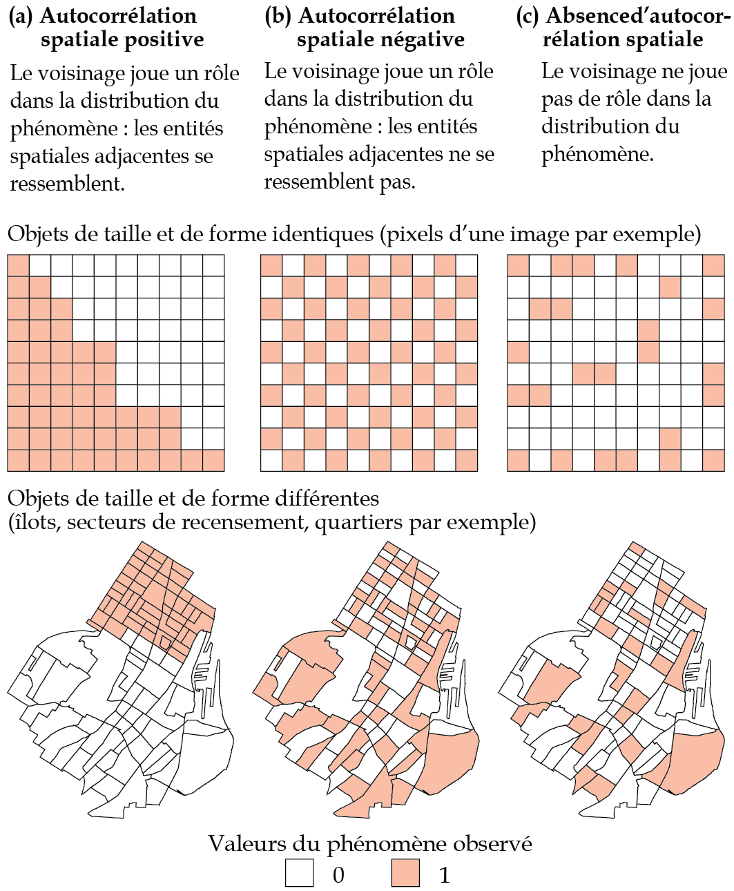
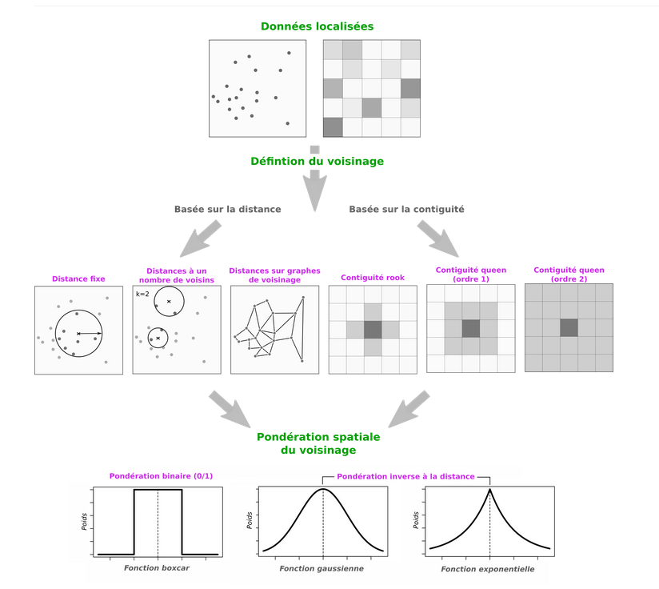
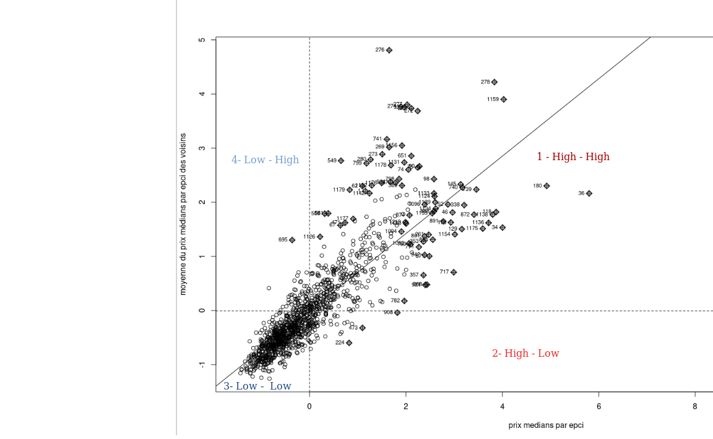
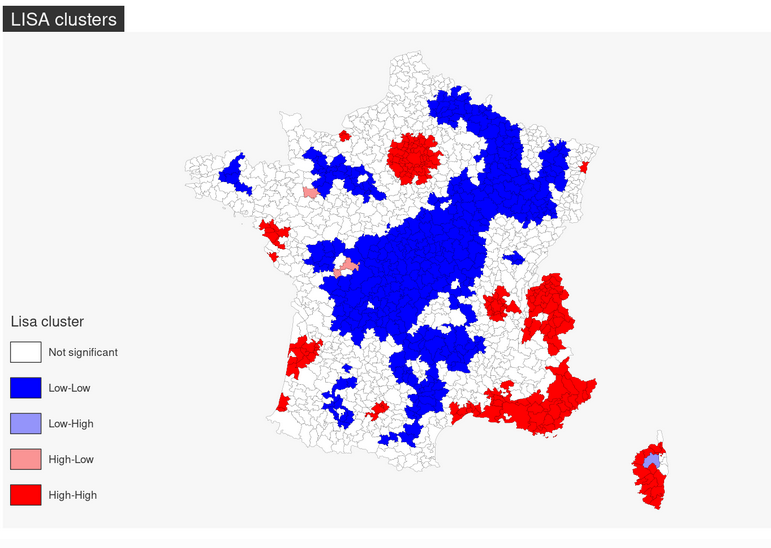
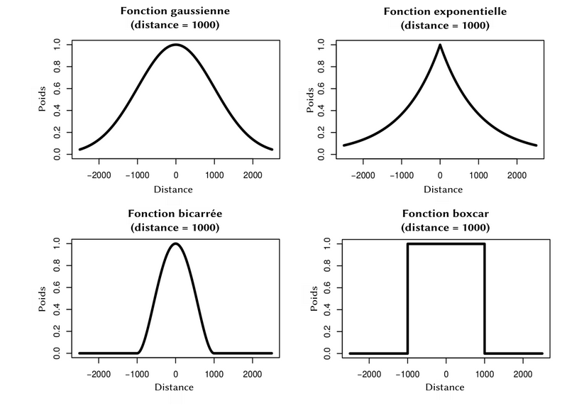

## Introduction {.center}

------------------------------------------------------------------------

## Objectifs du cours

-   Comprendre les limites de la régression classique
-   Découvrir les enjeux de la dimension spatiale en analyse de données
-   Découvrir les concepts fondamentaux de la statistique spatiale
-   Appliquer ces méthodes avec R
-   Découvrir d'autres outils de représentation : Geoda et Magrit

::: notes
Ce cours s'appuie sur vos connaissances en régression linéaire. L'objectif n'est pas de tout refaire, mais d'élargir votre boîte à outils pour traiter des données géographiques. La statistique spatiale n'est pas une discipline à part, c'est une extension nécessaire quand les données ont une dimension géographique.
:::

------------------------------------------------------------------------

## Plan

1.  Rappels : Régression linéaire classique
2.  Introduction à la statistique spatiale
3.  L'autocorrélation spatiale
4.  Indicateurs locaux (LISA)
5.  L'hétérogénéité spatiale et la GWR
6.  (les autres méthodes de l'hétérogénéité spatiale)
7.  (Les modèles de régressions spatiale)

::: notes
La progression est importante : on part du basique (régression classique) pour montrer progressivement pourquoi ces méthodes sont insuffisantes avec des données spatiales. D'abord identifier les problèmes (autocorrélation, hétérogénéité), puis apprendre à les mesurer (Moran, LISA), enfin découvrir les solutions (GWR).
:::

------------------------------------------------------------------------

## Environnement de travail {.center}

------------------------------------------------------------------------

## [R : le moteur !](https://cran.r-project.org/bin/windows/base/)

::: r-stack
{fig-align="center" width="100%" style="margin-top:10px; margin-bottom:0px"}
:::

------------------------------------------------------------------------

## [Rstudio : l'interface de travail](https://posit.co/download/rstudio-desktop/)

::: r-stack
{fig-align="center" width="100%" style="margin-top:10px; margin-bottom:0px"}
:::

------------------------------------------------------------------------

## [Geoda : fait pour l'autocorrelation et les LISA](https://geodacenter.github.io/download/)

::: r-stack
{fig-align="center" width="100%" style="margin-top:10px; margin-bottom:0px"}
:::

------------------------------------------------------------------------

## [Magrit : le logiciel de carto !](https://magrit.cnrs.fr/)

::: r-stack
{fig-align="center" width="100%" style="margin-top:10px; margin-bottom:0px"}
:::

------------------------------------------------------------------------

## [Github : accéder à tout le cours](https://github.com/LeCampionG/deca4_2026)

::: r-stack
{fig-align="center" width="100%" style="margin-top:10px; margin-bottom:0px"}
:::

------------------------------------------------------------------------

## Premier pas en codage !

::: {.callout-tip icon="false"}
## Etape 1

Double-cliquer sur le fichier `script_liste_packages.r`
:::

``` r
# Pour installer un package

install.packages("mapsf")

# Pour l'appeler dans r

library(mapsf)
```

::: callout-warning
## Félicitaions

Bravo vous voilà développeurs !
:::

------------------------------------------------------------------------

## Découverte des données {.center}

------------------------------------------------------------------------

## Charger les données tabulaires

On utilise le package `here` pour gérer les chemins d’accès, ici on spécifie où on se situe :

```{r}
#| echo: true
#| message: false
#| warning: false

library(here)

csv_path <- here("data", "donnees_standr.csv")
immo_df <- read.csv2(csv_path)

#Pour visualiser les données
library(DT)

# datatable(head(immo_df, 10))

```

::: r-stack
{fig-align="center" width="70%" style="margin-top:10px; margin-bottom:0px"}
:::

------------------------------------------------------------------------

## Charger des données spatiales

```{r}
#| echo: true
#| message: false
#| warning: false


library(sf)


shp_path <- here("data", "EPCI.shp")
epci_sf <- st_read(shp_path)

# et la table attributaire correspondante, avec le package DT
 # datatable(head(epci_sf, 10))

```

::: r-stack
{fig-align="center" width="70%" style="margin-top:10px; margin-bottom:0px"}
:::

------------------------------------------------------------------------

## Pour représenter vos données spatiale

```{r}
#| echo: true
#| message: false
#| warning: false


library(mapsf)

# pour voir les données géographiques
mf_map(x = epci_sf)

```

------------------------------------------------------------------------

## Rappels : La Régression Linéaire {.center}

{fig-align="center" width="50%" style="margin-top:10px; margin-bottom:0px"}

------------------------------------------------------------------------

## Qu'est-ce que la régression linéaire ?

**La régression linéaire cherche à expliquer ou prédire une variable Y par une ou plusieurs variables X.**

::: {style="font-size: 0.75em;margin-top:10px;"}
Elle peut être simple :

$$Y = a + bX + \epsilon$$

Ou multiple :

$$Y = \beta_0 + \beta_1 X_1 + \beta_2 X_2 + ... + \beta_n X_n + \epsilon$$

-   $\beta_0$ : ordonnée à l'origine
-   $\beta_i$ : coefficients de régression
-   $\epsilon$ : terme d'erreur
:::

::: notes
Rappel rapide : Y est la variable qu'on cherche à expliquer, les X sont les variables explicatives, les β quantifient l'effet de chaque X sur Y, et ε représente tout ce qui n'est pas expliqué par le modèle. Tout ce cours va montrer les limites de cette équation quand on a des données spatiales.
:::

------------------------------------------------------------------------

## Ce que permet la régression linéaire

::::: columns
::: {.column width="50%"}
**Objectifs**

-   Quantifier les relations entre variables
-   Prédire des valeurs
-   Tester des hypothèses
-   Identifier les variables significatives
:::

::: {.column width="50%"}
**Exemple simple**

Prix d'un bien immobilier :

-   Surface
-   Nombre de pièces
-   Localisation (code postal)
:::
:::::

::: notes
L'exemple immobilier est excellent car vous le comprenez tous intuitivement. Je vais y revenir tout au long du cours pour montrer les limites de la régression classique. Remarquez que la "localisation (code postal)" est traitée ici comme une simple variable catégorielle. Est-ce que cette façon de traiter la localisation vous semble suffisante ? La dimension spatiale est plus complexe qu'une simple variable. Pour l'instant, je fais comme si toutes les observations étaient indépendantes les unes des autres. Est-ce vraiment le cas pour des biens immobiliers proches géographiquement ?
:::

------------------------------------------------------------------------

## Visualisation du modèle

{fig-align="center" width="50%" style="margin-top:10px; margin-bottom:0px"}

::: aside
*Figure issue de Feuillet, T., Cossart, É. et Commenges, H. (2019). Chapitre 7. La régression linéaire. Manuel de géographie quantitative : Concepts, outils, méthodes (p. 158-179). Armand Colin.*
:::

------------------------------------------------------------------------

## Visualisation du modèle 2

{fig-align="center" width="60%" style="margin-top:10px; margin-bottom:0px"}

::: aside
*Figure issue de Feuillet, T., Cossart, É. et Commenges, H. (2019). Chapitre 7. La régression linéaire. Manuel de géographie quantitative : Concepts, outils, méthodes (p. 158-179). Armand Colin.*
:::

## Interpréter les coefficients

**Exemple** : Y = 2 000 + 500 × X

-   **a = 2 000** : salaire de base (avec 0 année d'expérience)
-   **b = 500** : chaque année d'expérience augmente le salaire de 2 000 €

::: fragment
**Prédiction** : Une personne avec 5 ans d'expérience :

Y = 2 000 + 500 × 5 = **4 500 €**
:::

::: notes
-   DIAPO IMPORTANTE pour comprendre la lecture de la régression
-   Coefficients a et b sont calculés par le logiciel, nous devons les INTERPRÉTER
-   a (intercept, ordonnée à l'origine) : valeur de Y quand X = 0
    -   Ici : quelqu'un sans expérience gagne 25 000€
    -   Attention : si X=0 n'a pas de sens dans le contexte, a n'a qu'une valeur technique
-   b (pente, coefficient) : effet de X sur Y
    -   Ici : chaque année supplémentaire ajoute 2 000€ au salaire
:::

------------------------------------------------------------------------

## Visualisation du modèle de l'exemple

```{r}
#| echo: false
#| fig-align: center
#| fig-height: 4

set.seed(42)
x <- seq(0, 10, length.out = 50)
y <- 3 + 2*x + rnorm(50, 0, 2)

plot(x, y, pch = 19, col = "steelblue",
     main = "Modèle de régression linéaire",
     xlab = "Années d'expérience", 
     ylab = "Salaire (milliers €)")
abline(lm(y ~ x), col = "red", lwd = 2)
text(2, 20, "Y = 2000 + 500X", col = "red", cex = 1.2)
```

------------------------------------------------------------------------

## Qualité du modèle : R²

::: {.callout-tip icon="false"}
## Coefficient de détermination

$$R^2 = 1 - \frac{\text{Variance résiduelle}}{\text{Variance totale}}$$
:::

**Interprétation** :

-   Varie de 0 à 1
-   R² = 0,75 → le modèle explique **75%** de la variabilité de Y

::: notes
-   R² (R-carré ou R-deux) : est en quelque sorte un indicateur de la qualité du modèle
-   Interprétation : % de variance de Y expliquée par X
-   R² = 0 : le modèle n'explique rien (X ne sert à rien)
-   R² = 1 : le modèle explique tout (prédictions parfaites)
-   En pratique : rarement 0 ou 1, généralement entre 0,2 et 0,8
-   Exemple : R² = 0,75 signifie que 75% des variations de salaire sont expliquées par l'expérience
-   Les 25% restants = autres facteurs (diplôme, secteur, négociation, etc.)
:::

------------------------------------------------------------------------

## Interpréter R²

| R²        | Interprétation   |
|-----------|------------------|
| \< 0,3    | Modèle faible    |
| 0,3 - 0,6 | Modèle moyen     |
| 0,6 - 0,8 | Bon modèle       |
| \> 0,8    | Excellent modèle |

::: callout-note
En SHS, un R² de 0,3-0,5 n'est pas rare.
:::

------------------------------------------------------------------------

## Mise en pratique avec R {.center}

------------------------------------------------------------------------

## Représentater le modèle avec R

::: {style="font-size: 0.6em;margin-top:20px;"}
Essayons tout d'abord de représenter un modèle !

Nous cherchons à expliquer le prix median de l'immobilier par le niveau de vie médian des menages par EPCI :
:::

```{r}
#| echo: true
#| message: false
#| warning: false


library(ggplot2)

plot1 <- ggplot(immo_df, aes(x = med_niveau_vis, y = prix_med)) + 
                         geom_point() + 
                         labs(title = "Relation prix median au m² vs niveau de vie median par EPCI") + 
                         xlab("niveau de vie median par EPCI (€)") + ylab("Prix median au m² (€)")+
                         theme(plot.title = element_text(face = "bold"))

plot1 + geom_point(col="blue") + geom_smooth(method = "lm", color="red", se=TRUE) + theme_grey()

```

------------------------------------------------------------------------

## Représentater le modèle avec R 2

::: {style="font-size: 0.6em;margin-top:20px;"}
Une autre manière de faire qui peut s'avérer pratique...
:::

```{r}
#| echo: true
#| message: false
#| warning: false


library(car)

car::scatterplot(prix_med ~ med_niveau_vis, data = immo_df, id = list(n=10)) 


```

## Créer le modèle statistique

::: {style="font-size: 0.6em;margin-top:20px;"}
Produire un modèle de régression rien de plus simple !
:::

```{r}
#| echo: true
#| message: false
#| warning: false


# Estimation du modèle avec la fonction lm (pour linear model)
lm1 <- lm(data = immo_df, formula = prix_med ~ med_niveau_vis)

summary(lm1)


```

::: notes
La t−value est le coefficient divisé par son erreur standard. Plus ce quotient est proche de 0 plus on peut considérer qu’il n’y a pas d’effet de notre VI sur notre VD. En revanche dans le cas où on aurait plus de 200 individus si \$\|t-value\| \> 1.96 \$ alors on peut considérer qu’il y a 95% de chance qu’il y ait un effet significatif de la VI sur la VD.
:::

------------------------------------------------------------------------

## Premiers résultats

::: {style="font-size: 0.75em;margin-top:20px;"}
La fonction summary() présente les estimations de façon brute, mais d’autres fonctions permettent des rendus plus esthétiques, comme avec le package gtsummary :
:::

```{r}
#| echo: true
#| message: false
#| warning: false
#| 
library(gtsummary)

# En tableau
gtsummary::tbl_regression(lm1)


```

------------------------------------------------------------------------

## Condition de réalisation d'une régression {.center}

------------------------------------------------------------------------

## Les hypothèses de la régression classique

1.  **Linéarité** : relation linéaire entre Y et X
2.  **Indépendance** : les observations sont indépendantes
3.  **Homoscédasticité** : variance constante des résidus
4.  **Normalité** : distribution normale des résidus
5.  **Pas d'autocorrélation** : les résidus ne doivent pas être auto-corrélés
6.  **Non-colinéarité** : les variables explicatives ne sont pas trop corrélées

::: notes
L'**indépendance** : c'est la 1ère hypothèse qui sera violée avec les données spatiales. Chaque observation doit être "indépendante" des autres, comme si on tirait des boules dans un sac. Viendra ensuite la **normalité** des résidus et leur **autocorrélation** \*Mise en garde\*\* : ces hypothèses sont rarement parfaitement respectées en pratique, mais avec les données spatiales, les violations sont particulièrement systématiques et importantes.
:::

------------------------------------------------------------------------

## Limites de la régression classique (1/2)

### Hypothèse d'indépendance des observations

En géographie, cette hypothèse est souvent **violée** :

-   Les phénomènes spatiaux sont rarement indépendants : **on parle de la dépendance spatiale : autocorrélation des résidus.**
-   "Tout est lié à tout, mais les choses proches sont plus liées que les choses éloignées" (Tobler, 1970)

::: notes
La citation de Tobler est fondamentale. Voici des exemples concrets : si un appartement est cher dans une rue, les appartements voisins seront probablement chers aussi. Si une commune a un taux de chômage élevé, les communes voisines ont souvent des taux similaires. La pollution de l'air ne s'arrête pas aux frontières administratives.

Pourquoi cette violation est-elle problématique ? Si les observations ne sont pas indépendantes, les tests statistiques (p-values, intervalles de confiance) ne sont plus valides. Je risque de surestimer la précision de mes estimations. **Mise en garde** : ce n'est pas un problème mineur qu'on peut ignorer, c'est une caractéristique intrinsèque des données géographiques.
:::

------------------------------------------------------------------------

## Limites de la régression classique (2/2)

### Hypothèse de stationnarité

La régression classique suppose des **coefficients constants** dans l'espace :

-   L'effet d'une variable est le même partout
-   Pas de prise en compte des variations locales
-   Inadapté pour des phénomènes géographiques hétérogènes et plus largement en SHS

::: notes
Imaginons qu'on étudie l'effet du niveau d'éducation sur le salaire. Est-ce que cet effet est le même à Paris qu'en zone rurale ? Probablement pas : à Paris où la concurrence est forte et les emplois qualifiés nombreux, l'éducation a peut-être un effet plus important.

Autre exemple : l'effet de la surface d'un logement sur son prix. En centre-ville dense, chaque m² compte énormément. En zone rurale où l'espace est abondant, l'effet est plus faible.

La régression classique donne UN SEUL coefficient par variable pour toute la zone d'étude. C'est comme calculer une température moyenne pour toute la France : ce n'est pas faux, mais je perds beaucoup d'information locale.
:::

------------------------------------------------------------------------

## Diagnostiquer la régression avec R {.center}

------------------------------------------------------------------------

## On complexifie notre modèle

::: callout-warning
## Attention

Avant de lancer ce modèle des conditions d'applications doivent être vérifiées!
:::

```{r}
#| echo: true
#| message: false
#| warning: false

mod.lm <- lm(formula = prix_med ~ perc_log_vac + perc_maison + 
                      perc_tiny_log + dens_pop + med_niveau_vis + 
                      part_log_suroccup + part_agri_nb_emploi +
                      part_cadre_profintellec_nbemploi, data = immo_df)
          

gtsummary::tbl_regression(mod.lm)

GGally::ggcoef_model(mod.lm)


```

------------------------------------------------------------------------

## Exploration des variables en jeu

```{r}
#| echo: true
#| message: false
#| warning: false

# Distribution de la variable dépendante :
hist(immo_df$prix_med, freq=FALSE, breaks = 35, col = "darkblue", border = "white", 
     main = "Prix median au m² par EPCI")

```

------------------------------------------------------------------------

## La linéarité de la relation entre VD et VI

```{r}
#| echo: true
#| message: false
#| warning: false

library(car)

scatterplotMatrix(~prix_med + perc_log_vac + perc_maison + 
                    perc_tiny_log + dens_pop + med_niveau_vis + 
                    part_log_suroccup + part_agri_nb_emploi +
                    part_cadre_profintellec_nbemploi,
                   data=immo_df, smoother=loessLine,
                  main="Matrice de graphiques cartésiens")

```

------------------------------------------------------------------------

## La multicolinéarité entre les VI

### Etude des corrélations

```{r}
#| echo: true
#| message: false
#| warning: false

library(correlation)

data_cor <- immo_df %>% select(-SIREN)
immo_cor <- correlation(data_cor, redundant = TRUE)
summary(immo_cor)

library(see)
immo_cor %>%
  summary(redundant = FALSE) %>%
  plot(type="tile", show_labels =TRUE, show_p = TRUE, digits = 1, size_text=3)


```

::: notes
Un des enjeux les plus important dans le cadre de régression multiple est de vérifier la multicolinéarité entre les variables explicatives. Le risque d’une trop grande colinéarité est de biaiser le modèle et et notamment de biaiser les estimations des erreurs type des coefficient de régression (et donc les t-value et p-value). Par ailleurs, on ne saura en réalité quelle variable agit sur quoi.
:::

------------------------------------------------------------------------

## La multicolinéarité entre les VI

### Le VIF

::: callout-tip
## VIF

La VIF (Variance Inflation Factor) est une très bonne méthode pour vérifier les risques de multicolinéarité. Elle suppose simplement d’avoir estimé un premier modèle pour être utilisée.
:::

```{r}
#| echo: true
#| message: false
#| warning: false

library(car)

vif(mod.lm)

# On peut aussi directement l'ajouter au résumé des coefficient obtenu avec gtsummary

library(gtsummary)

mod.lm %>%
  tbl_regression(intercept = TRUE) %>% add_vif()

```

::: notes
A priori pas de table de la loi indiquant le seuil absolu de VIF à ne pas dépasser. Les sources en SHS varient en fonction des disciplines : certaines proposent 5 et d’autres même 10. Malgré tout, en géographie le consensus est autour d’une valeur critique de 4. Un VIF supérieur à 4 devrait entraîner la suppression de la variable du modèle car cela implique une forte colinéarité et donc un risque élevé de biaiser le modèle. A partir de 3 il convient de s’interroger sur la présence de la variable.

Au delà de la suppression ou non des variables concernées, il est aussi très important de pouvoir identifier les variables à VIF élevés.
:::

------------------------------------------------------------------------

## Analyse des résidus

::: {.callout-tip icon="false"}
## Notes

L’analyse des résidus est très importante car les conditions de validité d’un modèle linéaire au delà des résultats repose grandement sur les résidus. Ils permettent en outre d’identifier les individus extrêmes (ou outliers).
:::

```{r}
#| echo: true
#| message: true
#| warning: false

par(mfrow=c(1,3))
plot(rstudent(mod.lm))
hist(rstudent(mod.lm), breaks = 20, col="darkblue", border="white", main="Analyse visuelle des résidus")
qqPlot(mod.lm)

```

::: notes
Pour rappel, les résidus correspondent à l’écart au modèle. Ainsi, un résidu \> 0 implique que notre individu a été sous-estimé par le modèle (il est au dessus de la droite de régression), un résidu \< 0 que l’individu a été sur-estimé par le modèle (il est sous la droite de régression).

Ces fonctions permettent de représenter graphiquement les résidus standardisés pour caractériser leur normalité et leur grandeur. Les valeurs supérieures à 2 sont considérées comme fortes
:::

------------------------------------------------------------------------

## Analyse des résidus 2

::: {style="font-size: 0.75em;margin-top:20px;"}
Si la voie graphique ne vous inspire pas il existe des tests statistiques qui permettent de vérifier la normalité des résidus ou bien leur homoscédasticité.

Ils ont cela de particulier qu’ici nous cherchons à accepter H0 et donc pour valider la normalité ou l’homoscédasticité il faut que $p−value>0.05$
:::

```{r}
#| echo: true
#| message: true
#| warning: false

# Pour étudier la normalité on peut utiliser le test de Shapiro-Wilk
shapiro.test(mod.lm$residuals)

# Pour évaluer l'homoscédasticité on peut utiliser le test de Breusch-Pagan. Le package car propose une fonction pour le réaliser
ncvTest(mod.lm)

```

------------------------------------------------------------------------

## Outliers

::: callout-warning
## Aparte

La question des outliers (ou individus extrême) est très importante ! Un seul individu de par son côté extrême pourra faire varier voire fausser complétement notre test.
:::

```{r}
#| echo: true
#| message: true
#| warning: false

immo_df[c(36,266),]

```

::: notes
La question des outliers est toujours sensible, il faut se poser sérieusement la question de le supprimer ou de les conserver. Les conserver expose à un vrai risque sur la fiabilité de notre test. Et pose en plus a question de ce qu'on mesure dasn notre cas étudie t'on globalement le prix de l'immobilier sur la France hexagonale ou l'écart de tous les EPCI avec celui de Paris.
:::

------------------------------------------------------------------------

## Outliers 2

Voyons les conséquences si on relance la régression sans l’individu 266

```{r}
#| echo: true
#| message: true
#| warning: false
#| 
mod.lm2 <- update(mod.lm, subset=-266)
summary(mod.lm2)
```

```{r}
#| echo: true
#| message: true
#| warning: false
par(mfrow=c(1,2))
plot(rstudent(mod.lm2)) 
qqPlot(mod.lm2)
```

```{r}
#| echo: true
#| message: true
#| warning: false
car::compareCoefs(mod.lm, mod.lm2, pvals = TRUE)
```

------------------------------------------------------------------------

## Introduction à la Statistique Spatiale {.center}

------------------------------------------------------------------------

## Pourquoi la statistique spatiale ?

Les données spatiales ont des **propriétés particulières** :

-   **Position** : les observations ont une localisation
-   **Dépendance spatiale** : proximité = similitude
-   **Hétérogénéité spatiale** : les processus varient dans l'espace

::: notes
**Position** : Ce n'est pas qu'une variable de plus ! La position dans l'espace structure les phénomènes. Un commerce n'a pas le même potentiel selon où il se trouve, même avec les mêmes caractéristiques.

**Dépendance spatiale** : C'est le problème d'autocorrélation vu précédemment.

**Hétérogénéité spatiale** : Les relations varient d'un endroit à l'autre, c'est le problème de non-stationnarité.

Ce ne sont pas des "bugs" de nos données, ce sont des caractéristiques intrinsèques qu'il faut prendre en compte. La statistique spatiale n'est pas une discipline totalement différente, c'est une extension de la statistique classique.
:::

------------------------------------------------------------------------

## Les deux problèmes fondamentaux

::::: columns
::: {.column width="50%"}
### 1. Autocorrélation spatiale

Les observations voisines se ressemblent

**Conséquence** : violation de l'hypothèse d'indépendance
:::

::: {.column width="50%"}
### 2. Non-stationnarité spatiale

Les relations varient dans l'espace

**Conséquence** : coefficients non constants
:::
:::::

::: notes
**Autocorrélation** : Si je connais la valeur à un endroit, je peux deviner qu'elle sera similaire tout près. C'est une violation de l'indépendance car les observations "s'influencent" mutuellement. Exemple : si je sais qu'un quartier est riche, je peux parier que le quartier d'à côté l'est aussi.

**Non-stationnarité** : La même cause n'a pas le même effet partout. C'est un problème car j'estime un seul coefficient alors qu'il devrait varier. Exemple : l'effet de l'éducation sur le revenu peut être plus fort dans les métropoles que dans les zones rurales.

**Mise en garde** : Ces deux problèmes sont différents et nécessitent des solutions différentes. Je peux avoir l'un sans l'autre, ou les deux simultanément.
:::

------------------------------------------------------------------------

## Comment la statistique spatiale répond

**Pour l'autocorrélation** :

-   Mesurer et tester l'autocorrélation spatiale
-   Modèles spatiaux (SAR, SEM, etc.)

**Pour la non-stationnarité** :

-   Régressions géographiquement pondérées (GWR)
-   Modèles locaux

::: notes
Il faut d'abord DIAGNOSTIQUER (mesurer) avant de TRAITER. Les modèles SAR (Spatial AutoRegressive) et SEM (Spatial Error Model) sont des extensions de la régression qui intègrent explicitement la dépendance spatiale. Dans ce cours d'initiation, je me concentrerai surtout sur la mesure (I de Moran, LISA).

La GWR sera le cœur de la deuxième partie du cours. "Géographiquement pondérées" signifie que les coefficients varient selon la position géographique. Au lieu d'un modèle global, je fais des modèles locaux.

**Mise en garde** : Ces solutions ne sont pas exclusives. Je peux avoir besoin de traiter les deux problèmes simultanément (d'où les modèles GWRSAR).
:::

------------------------------------------------------------------------

## Préparation des données en vue de la stat spatiale ! {.center}

------------------------------------------------------------------------

## La jointure

```{r}
#| echo: true
#| message: true
#| warning: false


# l'option all.x = TRUE permet de garder toutes les lignes de epci_sf,
# même celles qui n'ont pas de correspondance dans immo_df
data_immo <- merge(x = epci_sf, y = immo_df, by.x = "CODE_SIREN", by.y = "SIREN", all.x = TRUE)


nrow(immo_df)

nrow(epci_sf)

nrow(data_immo)


```

------------------------------------------------------------------------

## Représenter

```{r}
#| echo: true
#| message: true
#| warning: false


mf_map(x = data_immo)
mf_map(x = data_immo[is.na(data_immo$prix_med),], col = 'red', add = TRUE)


```

------------------------------------------------------------------------

## La nouvelle jointure

```{r}
#| echo: true
#| message: true
#| warning: false


data_immo <- merge(x = epci_sf, y = immo_df, by.x = "CODE_SIREN", by.y = "SIREN")
nrow(data_immo)


mf_map(x = data_immo)

# Pour exporter 

# st_write(data_immo, "data_immo.gpkg", driver = "GPKG")

```

------------------------------------------------------------------------

## La carte du prix de l'immobilier

```{r}
#| echo: true
#| message: true
#| warning: false
#| 

# La palette de couleurs :
cols_v1 <- c("#08519c", "#3182bd", "#6baed6", "#9ecae1", "#c6dbef", "#eff3ff", "#ffffce", "#fee5d9", "#fcbba1", "#fc9272",  "#fb6a4a", "#de2d26")

# Carte du prix médian 
mf_map(x = data_immo, 
       var = "prix_med", 
       type = "choro", 
       border = "#ebebeb", 
       lwd = 0.1, 
       breaks=quantile(data_immo$prix_med,seq(0,1, by=1/11)), 
       pal=cols_v1, 
       leg_title = "Prix médian", 
       leg_val_rnd = 1)
mf_title("Prix Médian du logement par EPCI France Métropolitaine") #titre

```

------------------------------------------------------------------------

## La carte des résidus... ou montrer la structure spatiale

```{r}
#| echo: true
#| message: true
#| warning: false


data_immo$res_reg <- mod.lm$residuals

# Définition d'une palette de couleur
cols_v1 <- c("#08519c", "#3182bd", "#6baed6", "#9ecae1", "#c6dbef", "#eff3ff", "#ffffce", "#fee5d9", "#fcbba1", "#fc9272",  "#fb6a4a", "#de2d26")

# Réalisation de la carte
mf_map(x = data_immo, 
       var = "res_reg", 
       type = "choro", 
       border = "#ebebeb", 
       lwd = 0.1, 
       breaks=quantile(data_immo$res_reg,seq(0,1, by=1/11)), 
       pal=cols_v1, 
       leg_title = "Résidus de régression\nlinéaire 'classique'", 
       leg_val_rnd = 1)
mf_title("Résidus modèle lm") #titre

```

------------------------------------------------------------------------

## L'Autocorrélation Spatiale {.center}

------------------------------------------------------------------------

## Définition

L'autocorrélation spatiale mesure la **similitude** entre observations voisines :

-   **Positive** : les valeurs similaires sont proches
-   **Négative** : les valeurs dissimilaires sont proches
-   **Nulle** : distribution aléatoire dans l'espace

------------------------------------------------------------------------

## Représentation

{width="35%" fig-align="center"}

::: aside
*Figure tirée de Apparicio P. et J. Gelb (2024). Méthodes d’analyse spatiales : un grand bol d’R. Université de Sherbrooke, Département de géomatique appliquée. fabriqueREL. Licence CC BY-SA*
:::

::: notes
**Autocorrélation positive** (le cas le plus fréquent) : Les prix immobiliers élevés sont regroupés dans certains quartiers, les prix faibles dans d'autres. Visuellement, je vois des "taches" sur une carte. C'est la traduction statistique de la loi de Tobler.

**Autocorrélation négative** (plus rare) : Les valeurs opposées sont côte à côte, comme un damier. Exemple théorique : alternance de zones riches et pauvres. En pratique, assez rare dans les phénomènes sociaux ou économiques.

**Absence d'autocorrélation** : La position n'a pas d'importance. C'est comme si j'avais mélangé au hasard les valeurs sur la carte. C'est l'hypothèse de la régression classique.

**Mise en garde** : L'autocorrélation n'est pas "bien" ou "mal", c'est une caractéristique des données qu'il faut identifier et prendre en compte.
:::

------------------------------------------------------------------------

## La matrice de poids spatiaux (1/2)

Pour mesurer l'autocorrélation, il faut définir le **voisinage** :

**Matrice W** : qui est voisin de qui ?

-   $w_{ij} = 1$ si i et j sont voisins
-   $w_{ij} = 0$ sinon

::: notes
**Analogie** : Imaginez que je crée un réseau social géographique. La matrice W dit qui est "ami" avec qui basé sur la proximité géographique. Si deux communes sont voisines, W = 1 (elles sont "amies"). Sinon W = 0.

Pour calculer l'autocorrélation, je dois comparer chaque observation avec ses voisins. Mais qui sont ses voisins ? C'est ce que définit la matrice W. C'est une matrice n×n où n est le nombre d'observations.

**Mise en garde** : Il n'y a pas UNE SEULE façon de définir le voisinage. C'est un choix méthodologique. En pratique avec R, des fonctions calculent automatiquement cette matrice, vous n'aurez pas à la construire à la main.
:::

------------------------------------------------------------------------

## La matrice de poids spatiaux (2/2)

### Différentes définitions du voisinage

{width="35%" fig-align="center"}

::: aside
*Figure issue de Feuillet, T., Cossart, É. et Commenges, H. (2019). Manuel de géographie quantitative : Concepts, outils, méthodes. Armand Colin.*
:::

::: notes
**Contiguïté Reine** : Analogie avec les échecs - la reine peut bouger en diagonale. Deux communes sont voisines si elles partagent un côté OU un coin. Pour une commune au centre d'une grille, la reine donne 8 voisins.

**Contiguïté Tour** : La tour ne bouge que horizontalement/verticalement. Deux communes sont voisines uniquement si elles partagent un côté. Pour une commune au centre, la tour donne seulement 4 voisins.

**Distance** : Je fixe un seuil (ex: 50 km). Toutes les communes à moins de 50 km sont voisines. **Mise en garde** : Certains points peuvent n'avoir aucun voisin si je choisis mal le seuil.

**k plus proches voisins** : Chaque observation a exactement k voisins (les k plus proches). Exemple : k=5 signifie que chaque commune a ses 5 communes les plus proches comme voisines.

Pour débuter, la contiguïté reine est souvent un bon choix pour des données communales/régionales.
:::

------------------------------------------------------------------------

## Voisinage avec R

```{r}
#| echo: true
#| message: true
#| warning: false
#| 
library(spdep)
# Création de la liste des voisins : avec l'option queen = TRUE, 
# sont considérés comme voisins 2 polygones possédant au moins 1 sommet commun
#help(poly2nb)
neighbours_epci <- poly2nb(data_immo, queen = TRUE) 

# cette opération se fait aussi avec un objet sp 
#shape_nbq <- poly2nb(shape, queen = TRUE)

# Obtention des coordonnées des centroïdes
#coord<-coordinates(shape)
coord <- st_coordinates(st_centroid(data_immo))

# Faire un graphe de voisinage
plot(neighbours_epci, coord)

# si on prend le 1er élément de neighbours_epci, on voit qu'il a pour voisins les polygones 62, 74 etc.
neighbours_epci[[1]]


# ce qu'on peut vérifier sur la carte :
neighbours1 <- data_immo[c(1,62,74,338,1135,1136,1137,1140),]
neighbours1$index <- rownames(neighbours1)
mf_map(x = neighbours1)
mf_label(x = neighbours1, var = "index")


```

------------------------------------------------------------------------

## Création de la matrice de voisinage

```{r}
#| echo: true
#| message: true
#| warning: false

# la fonction nb2listw attribue des poids à chaque voisin
# par ex. si un polygone a 4 voisins, ils auront chacun un poids de 1/4 = 0.25
#help("nb2listw")
neighbours_epci_w <- nb2listw(neighbours_epci)
# les poids sont stockés dans le 3ème élément de neighbours_epci_w
# par ex. si on veut connaître les poids des voisins du 1er élément :
neighbours_epci_w[[3]][1]


```

::: callout-tip
Comment faire si l’on a un polygone sans voisins ? Sur le plan technique, la fonction nb2listw prévoit ce cas de figure. Il faut utiliser l’argument zero.policy est indiquer TRUE. Au niveau théorique, c’est moins clair. De manière générale les indices d’autocorrélation spatiale et autres régressions spatiales ont été conçus en partant du principe que les entités spatiales avaient un voisinage. Ceci dit il n’y a pas à ma connaissance de règles qui obligent à les supprimer ou intégrer, ni de consensus scientifique sur l’approche à adopter.
:::

------------------------------------------------------------------------

## L'indice de Moran (I de Moran)

$$I = \frac{n}{\sum_{i}\sum_{j}w_{ij}} \times \frac{\sum_{i}\sum_{j}w_{ij}(x_i - \bar{x})(x_j - \bar{x})}{\sum_{i}(x_i - \bar{x})^2}$$

-   **I \> 0** : autocorrélation positive
-   **I ≈ 0** : pas d'autocorrélation
-   **I \< 0** : autocorrélation négative

::: notes
L'objectif n'est pas que vous reteniez cette formule par cœur, mais que vous compreniez l'intuition. Le numérateur $(x_i - \bar{x})(x_j - \bar{x})$ mesure si i et j s'écartent de la moyenne dans le même sens. Si les deux sont au-dessus de la moyenne (ou les deux en-dessous), le produit est positif. Le $w_{ij}$ pondère selon le voisinage : je ne compare que les voisins.

**Analogie** : C'est un peu comme un coefficient de corrélation entre une variable et elle-même décalée spatialement. D'où le terme "autocorrélation".

L'indice de Moran compare la variabilité entre voisins à la variabilité globale. Si les voisins sont très similaires, I sera élevé. Théoriquement, I est entre -1 et +1 comme une corrélation. En pratique, I proche de 0 suggère une distribution aléatoire. Avec R, le calcul est automatique.
:::

------------------------------------------------------------------------

## Interprétation de l'I de Moran

**Test d'hypothèse** :

-   H₀ : distribution spatiale aléatoire (I = 0)
-   H₁ : autocorrélation spatiale

**En pratique** :

-   Calcul de l'indice I
-   Test de significativité (permutations)
-   p-value pour rejeter H₀

::: notes
Calculer l'indice I ne suffit pas, il faut tester s'il est significativement différent de 0. H₀ : il n'y a pas d'autocorrélation, la distribution est aléatoire. Si I est significativement différent de 0, je rejette H₀.

Le test par permutations fonctionne ainsi : je calcule l'I observé sur mes données réelles, puis je mélange aléatoirement les valeurs sur la carte (en gardant les positions fixes) pour créer une distribution aléatoire. Je calcule I sur cette distribution aléatoire, je répète 999 fois, puis je compare mon I observé aux 999 I aléatoires.

**Interprétation de la p-value** : p \< 0.05 signifie autocorrélation significative, p \> 0.05 signifie que je ne peux pas rejeter l'hypothèse d'une distribution aléatoire.

**Mise en garde** : Un I élevé mais non significatif ne permet pas de conclure. Je dois toujours rapporter à la fois la valeur de I et la p-value.
:::

------------------------------------------------------------------------

## Visualisation : Diagramme de Moran

{width="65%" fig-align="center"}

Nuage de points : valeur vs. moyenne des voisins

::: notes
Le diagramme de Moran est un outil visuel très pédagogique. Axe horizontal : la valeur de l'observation (standardisée), axe vertical : la moyenne des valeurs des voisins (standardisée). Chaque point représente une observation.

Si les points suivent la diagonale ascendante : autocorrélation positive (valeur élevée → voisins élevés). Si les points sont dispersés aléatoirement : pas d'autocorrélation. Si les points suivent une diagonale descendante : autocorrélation négative (rare).

La pente de la droite de régression dans ce diagramme est directement liée à l'indice de Moran. **Limite** : C'est une vue globale. Il ne dit pas OÙ se trouvent les clusters. C'est là qu'interviennent les LISA.
:::

------------------------------------------------------------------------

## Le prix de l'immobilier...

```{r}
#| echo: true
#| message: true
#| warning: false
#| 

# La palette de couleurs :
cols_v1 <- c("#08519c", "#3182bd", "#6baed6", "#9ecae1", "#c6dbef", "#eff3ff", "#ffffce", "#fee5d9", "#fcbba1", "#fc9272",  "#fb6a4a", "#de2d26")

# Carte du prix médian 
mf_map(x = data_immo, 
       var = "prix_med", 
       type = "choro", 
       border = "#ebebeb", 
       lwd = 0.1, 
       breaks=quantile(data_immo$prix_med,seq(0,1, by=1/11)), 
       pal=cols_v1, 
       leg_title = "Prix médian", 
       leg_val_rnd = 1)
mf_title("Prix Médian du logement par EPCI France Métropolitaine") #titre


```

------------------------------------------------------------------------

## Moran avec R

```{r}
#| echo: true
#| message: true
#| warning: false
#| 

library(spdep)

# Pour l'occasion on va standardiser notre prix médian. 
# Cela permettra par la suite de le comparer à d'autres variables si d'autres analyses d'autocorrélation spatiale sont réalisées
data_immo$prix_med_z <- (data_immo$prix_med-mean(data_immo$prix_med))/sd(data_immo$prix_med)


# Test de Moran :

# On indique dans un premier temps la variable que l'on souhaite analyser
# Puis la matrice de voisinage
# L'argument zero.policy=TRUE permet de préciser que l'on souhaite intégrer à l'analyse les entités spatiales qui n'auraient pas de voisins
# L'argument randomisation=FALSE transmet à la fonction que nous supposons que la distribution est normale. Dans le cas contraire on devrait partir sur une solution de type Monte-Carlo qui repose sur la randomisation
moran.test(data_immo$prix_med_z, neighbours_epci_w, zero.policy = TRUE, randomisation = FALSE)


moran.plot(data_immo$prix_med_z,neighbours_epci_w, 
           labels = TRUE, 
           xlab="prix medians par epci", 
           ylab="moyenne du prix médians par epci des voisins")


```

------------------------------------------------------------------------

## Les Indicateurs LISA {.center}

------------------------------------------------------------------------

## Qu'est-ce que les LISA ?

**LISA** : Local Indicators of Spatial Association

-   Décomposition **locale** de l'I de Moran global
-   Identifie les **clusters spatiaux** locaux
-   Détecte les **valeurs atypiques** spatiales

::: notes
L'I de Moran donne UNE valeur pour toute la zone d'étude : "il y a de l'autocorrélation globalement". Les LISA donnent UNE valeur PAR observation : "cette commune contribue beaucoup/peu à l'autocorrélation".

Imagine que l'I de Moran soit élevé. Cela ne me dit pas : où sont les zones de valeurs élevées groupées ? Où sont les zones de valeurs faibles groupées ? Y a-t-il des valeurs atypiques ? Les LISA répondent à ces questions.

**Analogie** : C'est comme la différence entre dire "la France a une température moyenne de 15°C" (global) et faire une carte météo qui montre les températures locales (local).

Applications : en urbanisme pour identifier des poches de pauvreté, en santé publique pour détecter des clusters de maladies, en environnement pour localiser des zones de pollution.
:::

------------------------------------------------------------------------

## L'indice de Moran local

Pour chaque observation i :

$$I_i = \frac{(x_i - \bar{x})}{\sigma^2} \sum_{j} w_{ij}(x_j - \bar{x})$$

Mesure la **contribution locale** à l'autocorrélation globale

::: notes
Cette formule est plus simple que celle de l'I de Moran global. $(x_i - \bar{x})$ : écart de i par rapport à la moyenne, $(x_j - \bar{x})$ : écart du voisin j par rapport à la moyenne, $w_{ij}$ : pondération du voisinage.

Ii est élevé quand l'observation i s'écarte beaucoup de la moyenne ET ses voisins s'écartent aussi beaucoup dans le même sens. Ii \> 0 : i et ses voisins sont similaires. Ii \< 0 : i est différent de ses voisins (valeur atypique).

La somme (pondérée) de tous les Ii donne l'I de Moran global. C'est en ce sens que les LISA "décomposent" l'indice global.

**Mise en garde** : Comme pour l'I global, il faut tester la significativité de chaque Ii par permutations. R calcule automatiquement tous ces indices.
:::

------------------------------------------------------------------------

## Types de clusters (1/2)

::::: columns
::: {.column width="50%"}
### Hot spots (HH)

Valeur élevée entourée de valeurs élevées

### Cold spots (LL)

Valeur faible entourée de valeurs faibles
:::

::: {.column width="50%"}
### Outliers (HL)

Valeur élevée entourée de valeurs faibles

### Outliers (LH)

Valeur faible entourée de valeurs élevées
:::
:::::

::: notes
**Hot spots (HH)** : Une valeur élevée entourée de valeurs élevées. Exemples : un quartier riche dans une zone riche, une zone très polluée entourée de zones polluées. C'est le type de cluster le plus fréquent en cas d'autocorrélation positive.

**Cold spots (LL)** : Une valeur faible entourée de valeurs faibles. Exemples : un quartier pauvre dans une zone pauvre, une zone peu peuplée entourée de zones peu peuplées. Le "pendant" du hot spot.

**Outliers HL** : Valeur élevée isolée dans un environnement de valeurs faibles. Exemples : une commune riche dans une région pauvre, un commerce prospère dans une zone déprimée. Intéressant à étudier : pourquoi cette exception ?

**Outliers LH** : Valeur faible isolée dans un environnement de valeurs élevées. Exemples : une poche de pauvreté dans un quartier riche, une zone non polluée dans une région polluée. Pourquoi cette "résistance" locale ?

Ces 4 types correspondent aux 4 quadrants du diagramme de Moran.
:::

------------------------------------------------------------------------

## Types de clusters (2/2)

{width="75%" fig-align="center"}

::: notes
Cette carte illustre les 4 types de clusters sur des données réelles. Chaque couleur représente un type : généralement rouge pour HH (hot spots), bleu pour LL (cold spots), rose pour HL, bleu clair pour LH. Les zones en gris ou blanc sont non significatives.

Les hot spots et cold spots forment souvent de grandes zones contiguës. Les outliers sont généralement plus isolés et dispersés. Une grande partie de la carte peut être non significative - c'est normal !

**Mise en garde** : Ne pas confondre valeur élevée et hot spot. Une valeur élevée isolée sera un outlier HL, pas un hot spot. L'analyse LISA ne regarde pas la valeur elle-même, mais la valeur PAR RAPPORT à ses voisins.

Avec une telle carte, je peux identifier les zones à fort/faible développement, repérer les anomalies qui méritent attention, cibler des politiques d'aménagement. Les résultats dépendent de la définition du voisinage (matrice W).
:::

------------------------------------------------------------------------

## Interprétation des LISA

**Utilité** :

-   Identifier des **zones homogènes**
-   Détecter des **anomalies spatiales**
-   Guider les **politiques locales**
-   Compléter l'analyse globale

**Attention** : tenir compte des tests de significativité !

::: notes
Les hot spots et cold spots montrent où se regroupent des valeurs similaires. C'est utile pour définir des zones d'intervention prioritaires, comprendre la structure spatiale d'un phénomène.

Les outliers sont souvent les plus intéressants : pourquoi cette commune est-elle différente ? Y a-t-il des facteurs explicatifs locaux ? Peut-on en tirer des leçons ?

Les LISA ne remplacent pas l'I de Moran global, ils le complètent. Je fais : I de Moran (autocorrélation globale ?) puis LISA (où sont les clusters ?).

**Mise en garde cruciale** : Seuls les Ii statistiquement significatifs doivent être interprétés. Avec de nombreuses observations, je fais de nombreux tests → risque de faux positifs. Une carte LISA devrait toujours montrer uniquement les clusters significatifs.
:::

------------------------------------------------------------------------

## LISA avec R

```{r}
#| echo: true
#| message: true
#| warning: false


library(rgeoda)

# Pour utiliser la fonction local_moran proposée par le package rgeoda 2 pré-requis:

# 1- utiliser la fonction queen_weights du package rgeoda pour calculer une matrice de contiguïté de type queen 
queen_w <- queen_weights(data_immo)
# 2- Sortir la variable à étudier dans un vecteur
prix_med_z = data_immo["prix_med_z"]

lisa <- local_moran(queen_w, prix_med_z)

# Pour visualiser les résultats des LISA il faut les stocker dans des objets ou dans les base de données pour les représenter 
lisa_colors <- lisa_colors(lisa)
lisa_labels <- lisa_labels(lisa)
lisa_clusters <- lisa_clusters(lisa)
lisa_value <- lisa_values(lisa)
lisa_pvalue<- lisa_pvalues(lisa)


# Carte de Moran locaux
data_immo$moranlocalvalue <- lisa_values(lisa)

cols_v2 <- c("#08519c", "#3182bd", "#6baed6", "#9ecae1", "#c6dbef", "#eff3ff", "#ffffce", "#fee5d9", "#fcbba1", "#fc9272",  "#fb6a4a", "#de2d26")

mf_map(x = data_immo, 
       var = "moranlocalvalue", 
       type = "choro", 
       border = "#ebebeb", 
       lwd = 0.1, 
       pal=cols_v2, 
       leg_title = "Local Moran", 
       leg_val_rnd = 1)
mf_title("Carte des LISA du prix médian du logement")


# Carte des p-value des moran locaux
data_immo$moranlocalpvalue<- lisa_pvalues(lisa)

library(dplyr)

# Pour plus de lisibilité dans la carte on va faire des classes des p-value
data_immo<- data_immo %>%  mutate(lisapvalue_fac = case_when(moranlocalpvalue <= 0.002 ~ "[0.001;0.002[",
                           moranlocalpvalue <= 0.01 ~ "[0.002;0.01[",
                           moranlocalpvalue <= 0.05 ~ "[0.01;0.05[",
                           TRUE ~ "[0.05;0.5]")) %>%
  mutate(lisapvalue_fac = factor(lisapvalue_fac,
                        levels = c("[0.001;0.002[", "[0.002;0.01[",
                                   "[0.01;0.05[",
                                  "[0.05;0.5]")))

mypal <- mf_get_pal(n = 4, palette = "Reds")

mf_map(x = data_immo, 
       var = "lisapvalue_fac", 
       type = "typo", 
       border = "grey3", 
       lwd = 0.1, 
       pal=mypal, 
       leg_title = "P-value Local Moran")
mf_title("Carte des significativité des LISA")

# Carte des clusters lisa avec rgeoda

plot(st_geometry(data_immo), 
     col=sapply(lisa_clusters, function(x){return(lisa_colors[[x+1]])}), 
     border = "#333333", lwd=0.2)
title(main = "Cluster LISA")
legend('bottomleft', legend = lisa_labels, fill = lisa_colors, border = "#eeeeee")


# En utilisant le package mapsf

data_immo$testmoran <- sapply(lisa_clusters, function(x){return(lisa_labels[[x+1]])})

colors <- c("white","blue",rgb(0,0,1,alpha=0.4),rgb(1,0,0,alpha=0.4),"red")

mf_map(x = data_immo, 
       var = "testmoran", 
       type = "typo", 
       border = "black", 
       lwd = 0.1, 
       pal= colors,
       val_order = c("Not significant","Low-Low","Low-High","High-Low","High-High"),
       leg_title = "Lisa cluster")
mf_title("LISA clusters")


```

## L'Hétérogénéité Spatiale {.center}

------------------------------------------------------------------------

## Le problème de la non-stationnarité

Dans une régression classique, les **coefficients sont constants** :

$$Y_i = \beta_0 + \beta_1 X_{1i} + \beta_2 X_{2i} + \epsilon_i$$

Mais en réalité, les effets peuvent **varier dans l'espace** !

::: notes
Dans l'équation classique, les β sont des constantes. Cela signifie que l'effet de X1 sur Y est le MÊME partout. Si β1 = 100, une augmentation d'une unité de X1 augmente Y de 100, que ce soit à Paris, à Bordeaux ou à Toulouse.

Pourquoi c'est problématique ? Les processus sociaux, économiques, environnementaux varient dans l'espace. Les marchés immobiliers ne fonctionnent pas de la même façon partout. L'effet de l'éducation sur le revenu peut varier selon le contexte local.

Avec un coefficient constant, je calcule une "moyenne" qui peut ne représenter correctement aucune zone particulière. **Analogie** : C'est comme porter des chaussures de pointure moyenne : elles ne conviennent à personne !

Je ne dis pas que la régression classique est "fausse", mais qu'elle est insuffisante pour capturer la complexité spatiale. Elle donne une vue d'ensemble utile, mais pas l'histoire locale.
:::

------------------------------------------------------------------------

## Exemple conceptuel

**Question** : Quel est l'effet de la surface sur le prix immobilier ?

-   En centre-ville : effet fort
-   En périphérie : effet plus faible
-   En zone rurale : effet encore différent

➜ Un seul coefficient global est **inadapté**

::: notes
Imaginons qu'on estime une régression classique sur toute une région métropolitaine : Prix = ... + 3000€ × Surface + ... Ce coefficient de 3000€/m² est une MOYENNE sur toute la zone.

**En centre-ville dense** : L'espace est très contraint, la demande forte. Chaque m² supplémentaire a une grande valeur. Le vrai coefficient pourrait être 5000€/m².

**En périphérie** : Plus d'espace disponible, demande modérée. L'effet de la surface est moins marqué. Le vrai coefficient pourrait être 2500€/m².

**En zone rurale** : Abondance d'espace, marché différent. La surface compte moins que d'autres facteurs. Le vrai coefficient pourrait être 1000€/m².

Le problème avec 3000€ : Ce coefficient moyen ne décrit correctement AUCUNE de ces trois zones. Je sous-estime l'effet en centre-ville, je le surestime en zone rurale. Conséquences : prédictions inexactes localement, compréhension erronée des mécanismes locaux.
:::

------------------------------------------------------------------------

## Solutions possibles

1.  **Variables d'interaction** : limité et arbitraire

2.  **Modèles par sous-zones** : perte de continuité spatiale

3.  **Geographically Weighted Regression (GWR)** :

    -   Coefficients variables dans l'espace
    -   Continuité spatiale préservée
    -   Exploration des variations locales

::: notes
**Variables d'interaction** : Ajouter des interactions entre les variables et des zones. Exemple : Prix = β1×Surface + β2×Surface×CentreVille + β3×Surface×Périphérie. Limites : nécessite de définir a priori des zones (arbitraire), effets constants DANS chaque zone (pas de gradualité), ne capture pas les variations continues dans l'espace.

**Modèles par sous-zones** : Estimer un modèle séparé pour chaque sous-région. Limites : nécessite de découper l'espace (frontières arbitraires), discontinuités artificielles aux frontières, nécessite beaucoup de données par zone.

**GWR** : Pas de découpage arbitraire (l'espace est traité de façon continue), coefficients variant graduellement (je capture les transitions douces), visualisation intuitive (je peux cartographier chaque coefficient).

**Analogie** : Interactions/sous-zones = découper une photo en zones de couleurs uniformes. GWR = garder toutes les nuances et dégradés de la photo originale.
:::

------------------------------------------------------------------------

## La GWR - Principes {.center}

------------------------------------------------------------------------

## Définition de la GWR

**Geographically Weighted Regression** :

Méthode de régression où les coefficients **varient localement** :

$$Y_i = \beta_0(u_i, v_i) + \sum_{k}\beta_k(u_i, v_i)X_{ki} + \epsilon_i$$

-   $(u_i, v_i)$ : coordonnées spatiales de i
-   $\beta_k(u_i, v_i)$ : coefficient variable dans l'espace

::: notes
Comparons avec la régression classique : Classique = $Y_i = \beta_0 + \beta_1 X_{1i} + ...$ (β constants). GWR = $Y_i = \beta_0(u_i, v_i) + \beta_1(u_i, v_i) X_{1i} + ...$ (β fonctions des coordonnées).

$\beta_k(u_i, v_i)$ signifie que le coefficient β de la variable k dépend de la position géographique (u, v) de l'observation i. C'est une fonction qui change continûment dans l'espace.

Au lieu d'avoir UN coefficient par variable pour tout le monde, j'ai un coefficient DIFFÉRENT pour chaque point de l'espace. Si j'ai 100 communes, j'aurai 100 coefficients pour chaque variable.

**Analogie** : Régression classique = dire "la température moyenne en France est 15°C". GWR = avoir une carte météo avec la température en chaque point.

**Mise en garde** : Nous n'aurons pas à faire les calculs à la main. R fera les calculs.
:::

------------------------------------------------------------------------

## Principe de la GWR (1/2)

Pour chaque point i, on estime un **modèle local** :

1.  Définir un **voisinage** autour de i
2.  **Pondérer** les observations selon leur distance à i
3.  Estimer les coefficients pour i
4.  Répéter pour chaque observation

::: notes
Pour chaque observation i, je vais estimer un modèle de régression LOCAL en donnant plus de poids aux observations proches et moins de poids aux observations éloignées.

Autour du point i où je veux estimer les coefficients, je définis une zone d'influence (déterminée par le bandwidth). Les observations très proches de i ont un poids élevé (proche de 1), les observations éloignées ont un poids faible (proche de 0). Je fais une régression pondérée. Je répète pour CHAQUE observation (si 100 communes, 100 régressions locales).

**Analogie** : Pour connaître le prix moyen des logements à un endroit précis, je donne plus de crédit aux transactions récentes dans le quartier immédiat.

**Mise en garde** : Ce n'est pas 100 régressions totalement indépendantes. Les voisinages se chevauchent, ce qui assure une continuité spatiale des coefficients.
:::

------------------------------------------------------------------------

## Principe de la GWR (2/2)

{width="70%" fig-align="center"}

Chaque point a son propre modèle local

::: notes
L'illustration montre un point central (en rouge) et un cercle autour représentant la zone d'influence (bandwidth). Les points à l'intérieur du cercle contribuent à l'estimation des coefficients pour le point central. Le dégradé de couleurs indique la pondération - plus foncé = poids plus élevé.

J'imagine que je déplace ce cercle sur toute la carte, point par point. À chaque position, j'obtiens un nouveau modèle local. Les cercles se chevauchent, ce qui crée une transition douce entre les coefficients.

**Différence avec OLS** : OLS = un seul modèle pour toute la carte. GWR = autant de modèles que de points, mais qui se "fondent" les uns dans les autres.
:::

------------------------------------------------------------------------

## La fonction de pondération

**Fonction gaussienne** (la plus courante) :

$$w_{ij} = \exp\left(-\frac{d_{ij}^2}{b^2}\right)$$

-   $d_{ij}$ : distance entre i et j
-   $b$ : **bandwidth** (largeur de bande)
-   Plus on s'éloigne de i, moins le poids est important

{width="30%" fig-align="center"}

::: notes
C'est une fonction exponentielle décroissante basée sur la distance. Quand $d_{ij} = 0$ (i et j au même endroit) : $w_{ij} = 1$ (poids maximum). Quand $d_{ij}$ augmente : $w_{ij}$ diminue exponentiellement. Quand $d_{ij}$ est très grand : $w_{ij} \approx 0$ (poids quasi nul).

Le bandwidth contrôle la vitesse de décroissance : b petit = décroissance rapide (seuls les voisins très proches ont un poids significatif). b grand = décroissance lente (même des observations éloignées gardent un poids notable).

**Analogie** : C'est comme l'influence d'une source lumineuse : très forte au centre, qui s'affaiblit progressivement avec la distance. Le bandwidth détermine la "portée" de la lumière.

La gaussienne est la plus courante, mais il existe d'autres fonctions (bi-square, tri-cube). R calcule automatiquement ces poids.
:::

------------------------------------------------------------------------

## Le paramètre clé : bandwidth

Le **bandwidth** (b) détermine la taille du voisinage :

-   **b petit** : forte variation locale, risque de sur-ajustement
-   **b grand** : lissage, se rapproche du modèle global
-   **b optimal** : minimise un critère (AICc, CV)

::: notes
Le choix du bandwidth est LA décision critique dans une GWR.

**Bandwidth petit** : Voisinage restreint, coefficients très variables. Avantage : capture les variations locales fines. **Mise en garde** : sur-ajustement (le modèle s'adapte au bruit plutôt qu'au signal). **Analogie** : zoomer très fort sur une photo - je vois les pixels.

**Bandwidth grand** : Voisinage étendu, coefficients variant lentement. Avantage : estimation stable. Risque : perte des variations locales intéressantes. Dans l'extrême, si b → ∞, je retrouve la régression OLS. **Analogie** : dézoomer sur une photo - je vois l'ensemble mais je perds les détails.

**Bandwidth optimal** : Compromis entre capturer les variations locales significatives sans sur-ajuster. Toujours utiliser la sélection automatique (AICc ou CV).

**Analogie** : Comme un thermostat - trop peu = confort variable, trop = pas d'adaptation, optimal = juste ce qu'il faut.
:::

------------------------------------------------------------------------

## Sélection automatique du bandwidth

**Critère AICc** (Akaike Information Criterion corrigé) :

-   Compromis ajustement / complexité
-   Correction pour petits échantillons
-   Sélection automatique possible

**Cross-validation** :

-   Validation croisée
-   Erreur de prédiction

::: notes
Le AICc équilibre deux objectifs : avoir un bon ajustement aux données (faible erreur) ET garder un modèle pas trop complexe (parcimonie). Le "corrigé" inclut une correction pour les petits échantillons, important pour la GWR car chaque modèle local n'utilise qu'un sous-ensemble des données.

Je teste différentes valeurs de bandwidth, pour chaque valeur je calcule l'AICc, je choisis le bandwidth qui minimise l'AICc. R le fait automatiquement avec `bw.gwr()`.

**Cross-validation** : Basée sur capacité prédictive. Je retire une observation, j'estime le modèle GWR sur les données restantes, je prédis la valeur de l'observation retirée, je calcule l'erreur. Je répète pour toutes les observations. Le bandwidth optimal minimise l'erreur de prédiction totale.

**Quelle méthode ?** AICc : plus rapide, recommandé par défaut. CV : plus lent mais préférable si l'objectif est la prédiction.

**Mise en garde** : Ne jamais fixer le bandwidth arbitrairement !
:::

------------------------------------------------------------------------

## Produire une GWR avec R

Pour réaliser une GWR sur R plusieurs packages reconnus existent. On peut citer notamment le package spgwret le package `GWmodel`. Nous choisirons d’utiliser ici le package `GWmodel`.

::: callout-note
Attention, les fonctions de ce package ne sont pas utilisables sur des objets de type sf, il faut travailler sur des objets de type Spatial DataFrame (SpatialPointsDataFrame or SpatialPolygonsDataFrame) (contrairement à spgwr qui peut travailler avec un format sf).
:::

```{r}
#| echo: true
#| message: true
#| warning: false


class(data_immo)

sp_data_immo <- as(data_immo, "Spatial")
class(sp_data_immo)

```

------------------------------------------------------------------------

## Calcul de la matrice des distances

La première étape est de calculer la distance entre toutes nos observations. Pour ce faire nous utiliserons la fonction `gw.dist()`.

```{r}
#| echo: true
#| message: true
#| warning: false

library(GWmodel)

# Pour construire la matrice de distances entre centroïdes des EPCI :
dm.calib <- gw.dist(dp.locat = coordinates(sp_data_immo))

```

------------------------------------------------------------------------

## La GWR - Interprétation {.center}

------------------------------------------------------------------------

## Résultats de la GWR

Pour chaque observation, on obtient :

1.  **Coefficients locaux** pour chaque variable
2.  **R² local** : qualité de l'ajustement local
3.  **Résidus** : erreurs de prédiction
4.  **Tests de significativité**

::: notes
La GWR produit beaucoup plus de résultats qu'une régression classique car tout est local. Si j'ai 3 variables et 100 observations, j'obtiens 300 coefficients (3×100). Chaque observation a ses propres coefficients. C'est une richesse mais aussi une complexité.

R² local mesure la qualité de l'ajustement pour chaque point. Je peux identifier où le modèle fonctionne bien/mal. **Mise en garde** : R² local peut être élevé même si le modèle sur-ajuste.

Les résidus sont locaux. Je peux vérifier si des patterns spatiaux persistent. Si résidus auto-corrélés → problème non résolu par GWR.

**Mise en garde** : Tests de significativité difficiles à interpréter avec GWR (problème de tests multiples).

La cartographie est essentielle pour visualiser et comprendre les patterns.
:::

------------------------------------------------------------------------

## Visualisation des coefficients

**Cartographie des coefficients** :

-   Une carte par variable explicative
-   Identifier les zones de forte/faible influence
-   Comprendre les variations spatiales des relations

::: notes
La cartographie est L'OUTIL essentiel pour interpréter une GWR. Sans carte, les centaines de coefficients sont inexploitables. Je crée une carte choroplèthe pour chaque variable où la couleur représente la valeur du coefficient local.

Je peux voir : zones où l'effet est fort (couleur foncée) vs faible (couleur claire), gradients spatiaux (l'effet augmente/diminue dans une direction), zones homogènes vs hétérogènes.

Exemple immobilier, carte du coefficient "Surface" : Rouge foncé en centre-ville = effet fort (5000€/m²), jaune en périphérie = effet modéré (2500€/m²), bleu en zone rurale = effet faible (1000€/m²).

Si j'ai 5 variables explicatives, je produirai 5 cartes + potentiellement une carte du R² local. Cette visualisation révèle souvent des patterns géographiques qu'on ne soupçonnait pas !
:::

------------------------------------------------------------------------

## Comparaison GWR vs. OLS

::::: columns
::: {.column width="50%"}
### Régression OLS

-   1 coefficient par variable
-   R² global
-   Hypothèse de stationnarité
:::

::: {.column width="50%"}
### GWR

-   n coefficients par variable
-   n R² locaux
-   Variation spatiale explicite
:::
:::::

**Test** : La GWR est-elle meilleure que l'OLS ?

::: notes
**Mise en garde** : GWR n'est pas toujours meilleure qu'OLS !

OLS : Simple, parcimonieux, facile à interpréter. UN résultat par variable qu'on peut facilement communiquer. Suffisant si l'hétérogénéité spatiale est faible.

GWR : Complexe, riche en information, difficile à résumer. BEAUCOUP de résultats qu'il faut visualiser. Nécessaire si forte hétérogénéité spatiale.

Je dois TOUJOURS commencer par estimer un modèle OLS, puis GWR, puis comparer : (1) AICc : GWR devrait avoir un AICc significativement plus faible, (2) R² : GWR aura un R² plus élevé (mais peut sur-ajuster !), (3) Résidus : Les résidus GWR ont-ils encore de l'autocorrélation ?, (4) Interprétabilité : Les patterns géographiques révélés par GWR sont-ils substantiels et interprétables ?

**Règle d'or** : Ne pas utiliser GWR systématiquement. Seulement si l'amélioration est substantielle, les variations géographiques ont du sens théoriquement, et j'ai suffisamment de données. Parfois, OLS suffit et est préférable (principe de parcimonie) !
:::

------------------------------------------------------------------------

## Avantages de la GWR

-   Capture l'**hétérogénéité spatiale**
-   Permet une **analyse locale** fine
-   **Exploration** des variations spatiales
-   Meilleure **capacité prédictive** (souvent)

::: notes
GWR révèle comment les relations varient dans l'espace, contrairement à OLS qui impose des coefficients constants. Elle permet de comprendre les spécificités de chaque zone - très utile pour les décideurs locaux qui veulent des informations sur LEUR territoire, pas une moyenne nationale.

GWR est un excellent outil exploratoire. Je découvre parfois des patterns géographiques inattendus qui génèrent de nouvelles hypothèses.

Souvent (mais pas toujours !), GWR prédit mieux que OLS car elle capture mieux les variations locales. À vérifier avec la cross-validation.

Applications concrètes : en urbanisme (adapter les politiques aux contextes locaux), en immobilier (prédictions plus précises localement), en santé (identifier facteurs de risque spécifiques à certaines zones).

**Mise en garde** : GWR est un outil puissant mais pas magique - il faut l'utiliser à bon escient.
:::

------------------------------------------------------------------------

## Limites et précautions (1/2)

**Problèmes possibles** :

-   **Multicolinéarité locale** : instabilité des coefficients
-   **Sur-ajustement** : bandwidth trop petit
-   **Autocorrélation spatiale** : résidus non indépendants
-   **Interprétation** : complexité accrue

::: notes
**Multicolinéarité locale** : Même si les variables ne sont pas trop corrélées globalement, elles peuvent l'être localement. Cela rend les coefficients locaux instables.

**Sur-ajustement** : Si le bandwidth est trop petit, le modèle s'adapte au bruit plutôt qu'au signal. D'où l'importance de la sélection automatique.

**Mise en garde importante** : GWR gère l'hétérogénéité, PAS l'autocorrélation ! Si mes résidus GWR sont encore autocorrélés, il faut peut-être un modèle GWRSAR.

**Complexité d'interprétation** : Avec des centaines de coefficients, difficile de communiquer simplement les résultats. Il faut résumer, cartographier, choisir quelques zones d'intérêt.
:::

------------------------------------------------------------------------

## Limites et précautions (2/2)

**Bonnes pratiques** :

1.  Toujours comparer avec un modèle OLS
2.  Vérifier la multicolinéarité locale
3.  Analyser les résidus (autocorrélation)
4.  Interpréter avec prudence
5.  Croiser avec expertise du terrain

::: notes
Ne jamais présenter seulement GWR. Je montre d'abord OLS, puis GWR, et je justifie pourquoi GWR apporte un plus. Si l'amélioration est marginale, je reste avec OLS (parcimonie).

Le package GWmodel fournit des diagnostics. **Mise en garde** : Si multicolinéarité locale forte, certains coefficients peuvent être très instables.

Je dois analyser les résidus : calculer l'I de Moran sur les résidus GWR. Si encore autocorrélés → GWR n'a pas tout résolu. Je cartographie les résidus pour voir où le modèle échoue.

Ne pas sur-interpréter de petites variations locales. Je me concentre sur les patterns géographiques forts et cohérents. Je tiens compte de l'incertitude des estimations locales.

Les variations géographiques révélées par GWR doivent faire sens au regard de la connaissance du terrain. Si un pattern est inexplicable, il est peut-être artéfactuel.

GWR est un outil puissant qui nécessite rigueur méthodologique et esprit critique.
:::

# VIII. Extensions de la GWR

## MGWR : Multiscale GWR

**Idée** : différentes variables peuvent varier à différentes échelles

-   Bandwidth **spécifique** par variable
-   Certaines variables à effet global
-   D'autres à effet local

$$Y_i = \sum_{k}\beta_k(u_i, v_i, b_k)X_{ki} + \epsilon_i$$

::: notes
GWR classique utilise le MÊME bandwidth pour toutes les variables. Cela implique que toutes les relations varient à la même échelle spatiale. Certains processus varient à petite échelle (effet très local), d'autres à grande échelle (effet régional), d'autres sont constants (effet global).

Exemple prix immobilier : Effet de la proximité aux transports = très local (petit bandwidth). Effet du niveau socio-économique régional = échelle moyenne. Effet de la conjoncture économique nationale = global (bandwidth infini = coefficient constant).

MGWR est plus flexible et souvent plus réaliste. Chaque variable trouve son échelle naturelle de variation. Package R `mgwrsar` permet d'estimer MGWR.

Pour ce cours d'initiation, comprendre le principe suffit.
:::

------------------------------------------------------------------------

## GWRSAR : GWR avec autocorrélation

Combine GWR et modèles d'autocorrélation spatiale :

-   Gère simultanément hétérogénéité ET autocorrélation
-   Modèle plus complexe
-   Package R : `mgwrsar`

::: notes
GWRSAR traite les DEUX problèmes identifiés au début : GWR traite l'hétérogénéité spatiale (coefficients variables), modèles SAR/SEM traitent l'autocorrélation (dépendance). Ces deux problèmes peuvent coexister ! Je peux avoir des coefficients qui varient dans l'espace ET des résidus autocorrélés.

GWRSAR combine les deux approches dans un modèle unifié. C'est le "couteau suisse" de la statistique spatiale.

Quand l'utiliser ? Après avoir fait GWR, si les résidus sont encore autocorrélés. Ou si je sais a priori que j'ai les deux problèmes.

**Mise en garde** : C'est un modèle avancé, difficile à estimer et interpréter. Réservé aux situations où la GWR simple ne suffit pas.

Package R `mgwrsar` est récent et puissant. Pour débuter, maîtriser GWR classique est suffisant. MGWR et GWRSAR sont des outils pour aller plus loin.
:::


