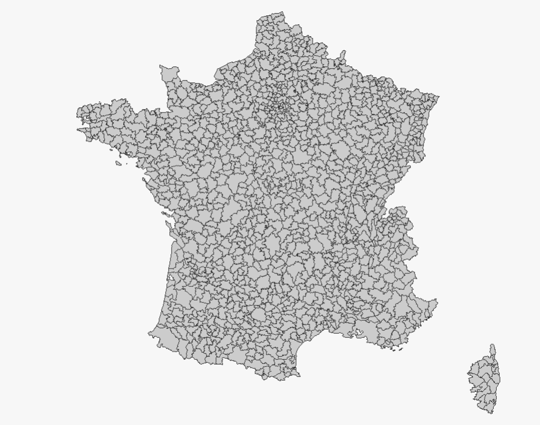

# Introduction

## Objectifs du cours

-   Comprendre les limites de la régression classique
-   Découvrir les enjeux de la dimension spatiale en analyse de données
-   Découvrir les concepts fondamentaux de la statistique spatiale
-   Appliquer ces méthodes avec R
-   Découvrir d'autres outils de représentation : Geoda et Magrit

::: notes
Ce cours s'appuie sur vos connaissances en régression linéaire. L'objectif n'est pas de tout refaire, mais d'élargir votre boîte à outils pour traiter des données géographiques. La statistique spatiale n'est pas une discipline à part, c'est une extension nécessaire quand les données ont une dimension géographique.
:::

------------------------------------------------------------------------

## Plan

1.  Rappels : Régression linéaire classique
2.  Introduction à la statistique spatiale
3.  L'autocorrélation spatiale
4.  Indicateurs locaux (LISA)
5.  L'hétérogénéité spatiale et la GWR
6.  (les autres méthodes de l'hétérogénéité spatiale)
7.  (Les modèles de régressions spatiale)

::: notes
La progression est importante : on part du basique (régression classique) pour montrer progressivement pourquoi ces méthodes sont insuffisantes avec des données spatiales. D'abord identifier les problèmes (autocorrélation, hétérogénéité), puis apprendre à les mesurer (Moran, LISA), enfin découvrir les solutions (GWR).
:::

# Environnement de travail

## [R : le moteur !](https://cran.r-project.org/bin/windows/base/)

::: r-stack
{fig-align="center" width="100%" style="margin-top:10px; margin-bottom:0px"}
:::

------------------------------------------------------------------------

## [Rstudio : l'interface de travail](https://posit.co/download/rstudio-desktop/)

::: r-stack
{fig-align="center" width="100%" style="margin-top:10px; margin-bottom:0px"}
:::

------------------------------------------------------------------------

## [Geoda : fait pour l'autocorrelation et les LISA](https://geodacenter.github.io/download/)

::: r-stack
{fig-align="center" width="100%" style="margin-top:10px; margin-bottom:0px"}
:::

------------------------------------------------------------------------

## [Magrit : le logiciel de carto !](https://magrit.cnrs.fr/)

::: r-stack
{fig-align="center" width="100%" style="margin-top:10px; margin-bottom:0px"}
:::

------------------------------------------------------------------------

## [Github : accéder à tout le cours](https://github.com/LeCampionG/deca4_2026)

::: r-stack
{fig-align="center" width="100%" style="margin-top:10px; margin-bottom:0px"}
:::

------------------------------------------------------------------------

## Premier pas en codage !

::: {.callout-tip icon="false"}
## Etape 1

Double-cliquer sur le fichier `script_liste_packages.r`
:::

``` r
# Pour installer un package

install.packages("mapsf")

# Pour l'appeler dans r

library(mapsf)
```

::: callout-warning
## Félicitaions

Bravo vous voilà développeurs !
:::

# Découverte des données

## Charger les données tabulaires

On utilise le package `here` pour gérer les chemins d’accès, ici on spécifie où on se situe :

``` r

library(here)

csv_path <- here("data", "donnees_standr.csv")
immo_df <- read.csv2(csv_path)

#Pour visualiser les données
library(DT)

datatable(head(immo_df, 10))
```

::: r-stack
{fig-align="center" width="70%" style="margin-top:10px; margin-bottom:0px"}
:::

------------------------------------------------------------------------

## Charger des données spatiales

``` r
library(sf)


shp_path <- here("data", "EPCI.shp")
epci_sf <- st_read(shp_path)

# et la table attributaire correspondante, avec le package DT
datatable(head(epci_sf, 10))
```

::: r-stack
{fig-align="center" width="70%" style="margin-top:10px; margin-bottom:0px"}
:::

------------------------------------------------------------------------

## Pour représenter vos données spatiale

``` r
library(mapsf)

# pour voir les données géographiques
mf_map(x = epci_sf)
```

::: r-stack
{fig-align="center" width="70%" style="margin-top:10px; margin-bottom:0px"}
:::

