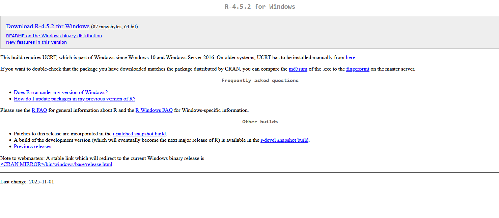
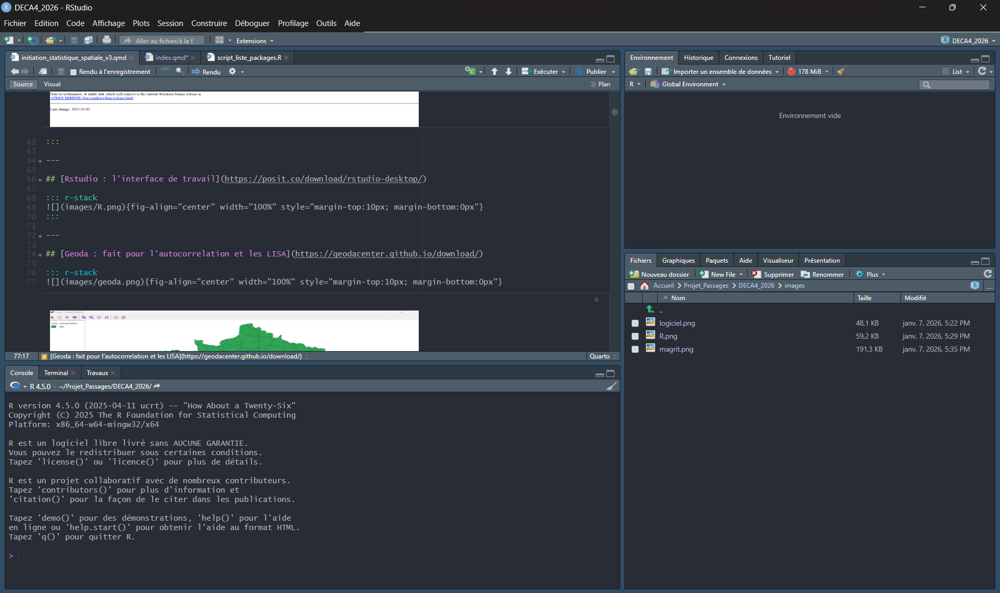
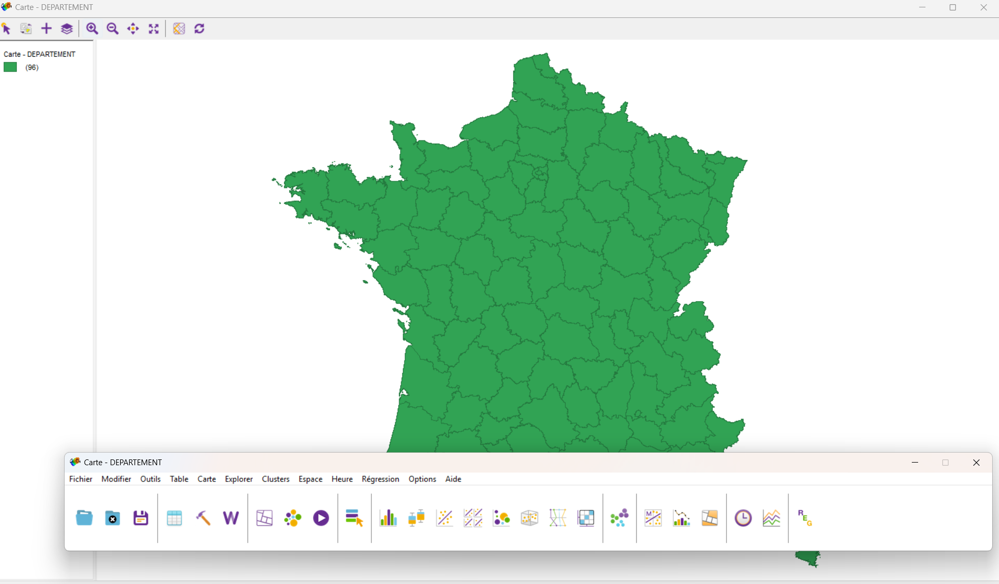
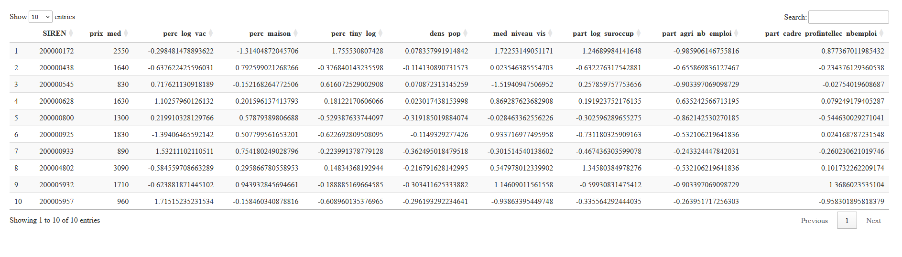
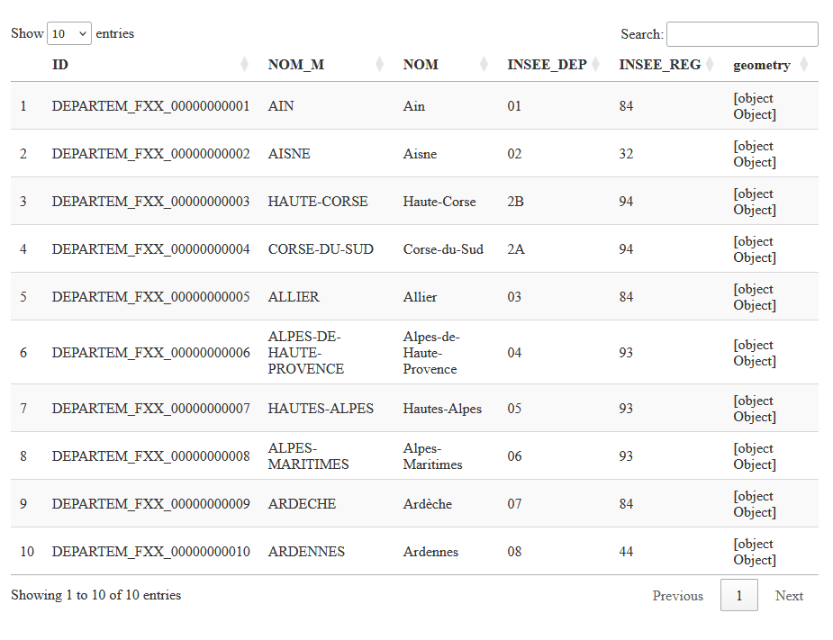
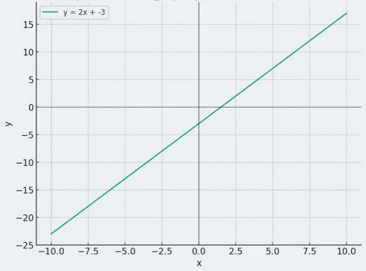
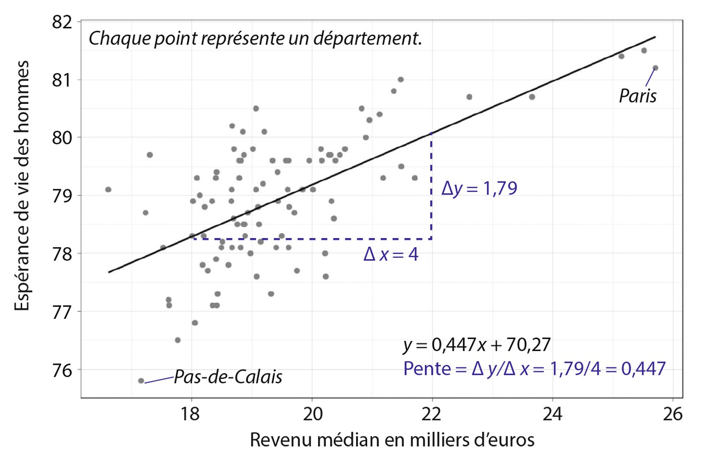
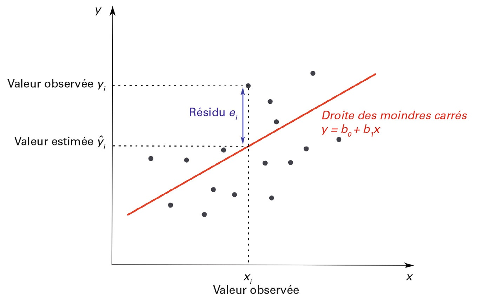

## Introduction {.center}

------------------------------------------------------------------------

## Objectifs du cours

-   Comprendre les limites de la régression classique
-   Découvrir les enjeux de la dimension spatiale en analyse de données
-   Découvrir les concepts fondamentaux de la statistique spatiale
-   Appliquer ces méthodes avec R
-   Découvrir d'autres outils de représentation : Geoda et Magrit

::: notes
Ce cours s'appuie sur vos connaissances en régression linéaire. L'objectif n'est pas de tout refaire, mais d'élargir votre boîte à outils pour traiter des données géographiques. La statistique spatiale n'est pas une discipline à part, c'est une extension nécessaire quand les données ont une dimension géographique.
:::

------------------------------------------------------------------------

## Plan

1.  Rappels : Régression linéaire classique
2.  Introduction à la statistique spatiale
3.  L'autocorrélation spatiale
4.  Indicateurs locaux (LISA)
5.  L'hétérogénéité spatiale et la GWR
6.  (les autres méthodes de l'hétérogénéité spatiale)
7.  (Les modèles de régressions spatiale)

::: notes
La progression est importante : on part du basique (régression classique) pour montrer progressivement pourquoi ces méthodes sont insuffisantes avec des données spatiales. D'abord identifier les problèmes (autocorrélation, hétérogénéité), puis apprendre à les mesurer (Moran, LISA), enfin découvrir les solutions (GWR).
:::

------------------------------------------------------------------------

## Environnement de travail {.center}

------------------------------------------------------------------------

## [R : le moteur !](https://cran.r-project.org/bin/windows/base/)

::: r-stack
{fig-align="center" width="100%" style="margin-top:10px; margin-bottom:0px"}
:::

------------------------------------------------------------------------

## [Rstudio : l'interface de travail](https://posit.co/download/rstudio-desktop/)

::: r-stack
{fig-align="center" width="100%" style="margin-top:10px; margin-bottom:0px"}
:::

------------------------------------------------------------------------

## [Geoda : fait pour l'autocorrelation et les LISA](https://geodacenter.github.io/download/)

::: r-stack
{fig-align="center" width="100%" style="margin-top:10px; margin-bottom:0px"}
:::

------------------------------------------------------------------------

## [Magrit : le logiciel de carto !](https://magrit.cnrs.fr/)

::: r-stack
{fig-align="center" width="100%" style="margin-top:10px; margin-bottom:0px"}
:::

------------------------------------------------------------------------

## [Github : accéder à tout le cours](https://github.com/LeCampionG/deca4_2026)

::: r-stack
{fig-align="center" width="100%" style="margin-top:10px; margin-bottom:0px"}
:::

------------------------------------------------------------------------

## Premier pas en codage !

::: {.callout-tip icon="false"}
## Etape 1

Double-cliquer sur le fichier `script_liste_packages.r`
:::

``` r
# Pour installer un package

install.packages("mapsf")

# Pour l'appeler dans r

library(mapsf)
```

::: callout-warning
## Félicitaions

Bravo vous voilà développeurs !
:::

------------------------------------------------------------------------

## Découverte des données {.center}

------------------------------------------------------------------------

## Charger les données tabulaires

On utilise le package `here` pour gérer les chemins d’accès, ici on spécifie où on se situe :

```{r}
#| echo: true
#| message: false
#| warning: false

library(here)

csv_path <- here("data", "donnees_standr.csv")
immo_df <- read.csv2(csv_path)

#Pour visualiser les données
library(DT)

# datatable(head(immo_df, 10))

```

::: r-stack
{fig-align="center" width="70%" style="margin-top:10px; margin-bottom:0px"}
:::

------------------------------------------------------------------------

## Charger des données spatiales

```{r}
#| echo: true
#| message: false
#| warning: false


library(sf)


shp_path <- here("data", "EPCI.shp")
epci_sf <- st_read(shp_path)

# et la table attributaire correspondante, avec le package DT
 # datatable(head(epci_sf, 10))

```

::: r-stack
{fig-align="center" width="70%" style="margin-top:10px; margin-bottom:0px"}
:::

------------------------------------------------------------------------

## Pour représenter vos données spatiale

```{r}
#| echo: true
#| message: false
#| warning: false


library(mapsf)

# pour voir les données géographiques
mf_map(x = epci_sf)

```

------------------------------------------------------------------------

## Rappels : La Régression Linéaire {.center}

{fig-align="center" width="50%" style="margin-top:10px; margin-bottom:0px"}

------------------------------------------------------------------------

## Qu'est-ce que la régression linéaire ?

**La régression linéaire cherche à expliquer ou prédire une variable Y par une ou plusieurs variables X.**

::: {style="font-size: 0.75em;margin-top:10px;"}

Elle peut être simple :

$$Y = a + bX + \epsilon$$

Ou multiple :

$$Y = \beta_0 + \beta_1 X_1 + \beta_2 X_2 + ... + \beta_n X_n + \epsilon$$

-   $\beta_0$ : ordonnée à l'origine
-   $\beta_i$ : coefficients de régression
-   $\epsilon$ : terme d'erreur

:::

::: notes
Rappel rapide : Y est la variable qu'on cherche à expliquer, les X sont les variables explicatives, les β quantifient l'effet de chaque X sur Y, et ε représente tout ce qui n'est pas expliqué par le modèle. Tout ce cours va montrer les limites de cette équation quand on a des données spatiales.
:::

------------------------------------------------------------------------

## Ce que permet la régression linéaire

::::: columns
::: {.column width="50%"}
**Objectifs**

-   Quantifier les relations entre variables
-   Prédire des valeurs
-   Tester des hypothèses
-   Identifier les variables significatives
:::

::: {.column width="50%"}
**Exemple simple**

Prix d'un bien immobilier :

-   Surface
-   Nombre de pièces
-   Localisation (code postal)
:::
:::::

::: notes
L'exemple immobilier est excellent car vous le comprenez tous intuitivement. Je vais y revenir tout au long du cours pour montrer les limites de la régression classique. Remarquez que la "localisation (code postal)" est traitée ici comme une simple variable catégorielle. Est-ce que cette façon de traiter la localisation vous semble suffisante ? La dimension spatiale est plus complexe qu'une simple variable. Pour l'instant, je fais comme si toutes les observations étaient indépendantes les unes des autres. Est-ce vraiment le cas pour des biens immobiliers proches géographiquement ?
:::

---

## Visualisation du modèle

{fig-align="center" width="50%" style="margin-top:10px; margin-bottom:0px"}

::: aside 
*Figure issue de Feuillet, T., Cossart, É. et Commenges, H. (2019). Chapitre 7. La régression linéaire. Manuel de géographie quantitative : Concepts, outils, méthodes (p. 158-179). Armand Colin.*
:::

------------------------------------------------------------------------

## Visualisation du modèle 2

{fig-align="center" width="60%" style="margin-top:10px; margin-bottom:0px"}

::: aside 
*Figure issue de Feuillet, T., Cossart, É. et Commenges, H. (2019). Chapitre 7. La régression linéaire. Manuel de géographie quantitative : Concepts, outils, méthodes (p. 158-179). Armand Colin.*
:::

## Interpréter les coefficients

**Exemple** : Y = 2 000 + 500 × X

-   **a = 2 000** : salaire de base (avec 0 année d'expérience)
-   **b = 500** : chaque année d'expérience augmente le salaire de 2 000 €

::: fragment
**Prédiction** : Une personne avec 5 ans d'expérience :

Y = 2 000 + 500 × 5 = **4 500 €**
:::

::: notes
-   DIAPO IMPORTANTE pour comprendre la lecture de la régression
-   Coefficients a et b sont calculés par le logiciel, nous devons les INTERPRÉTER
-   a (intercept, ordonnée à l'origine) : valeur de Y quand X = 0
    -   Ici : quelqu'un sans expérience gagne 25 000€
    -   Attention : si X=0 n'a pas de sens dans le contexte, a n'a qu'une valeur technique
-   b (pente, coefficient) : effet de X sur Y
    -   Ici : chaque année supplémentaire ajoute 2 000€ au salaire
:::

---

## Visualisation du modèle de l'exemple

```{r}
#| echo: false
#| fig-align: center
#| fig-height: 4

set.seed(42)
x <- seq(0, 10, length.out = 50)
y <- 3 + 2*x + rnorm(50, 0, 2)

plot(x, y, pch = 19, col = "steelblue",
     main = "Modèle de régression linéaire",
     xlab = "Années d'expérience", 
     ylab = "Salaire (milliers €)")
abline(lm(y ~ x), col = "red", lwd = 2)
text(2, 20, "Y = 2000 + 500X", col = "red", cex = 1.2)
```

------------------------------------------------------------------------

## Qualité du modèle : R²

::: {.callout-tip icon="false"}
## Coefficient de détermination

$$R^2 = 1 - \frac{\text{Variance résiduelle}}{\text{Variance totale}}$$
:::

**Interprétation** :

-   Varie de 0 à 1
-   R² = 0,75 → le modèle explique **75%** de la variabilité de Y

::: notes
-   R² (R-carré ou R-deux) : est en quelque sorte un indicateur de la qualité du modèle
-   Interprétation : % de variance de Y expliquée par X
-   R² = 0 : le modèle n'explique rien (X ne sert à rien)
-   R² = 1 : le modèle explique tout (prédictions parfaites)
-   En pratique : rarement 0 ou 1, généralement entre 0,2 et 0,8
-   Exemple : R² = 0,75 signifie que 75% des variations de salaire sont expliquées par l'expérience
-   Les 25% restants = autres facteurs (diplôme, secteur, négociation, etc.)
:::

------------------------------------------------------------------------

## Interpréter R²

| R²        | Interprétation   |
|-----------|------------------|
| \< 0,3    | Modèle faible    |
| 0,3 - 0,6 | Modèle moyen     |
| 0,6 - 0,8 | Bon modèle       |
| \> 0,8    | Excellent modèle |

::: callout-note
En SHS, un R² de 0,3-0,5 n'est pas rare.
:::

------------------------------------------------------------------------

## Mise en pratique avec R {.center}

---

## Représentater le modèle avec R

::: {style="font-size: 0.6em;margin-top:20px;"}
Essayons tout d'abord de représenter un modèle !

Nous cherchons à expliquer le prix median de l'immobilier par le niveau de vie médian des menages par EPCI :
:::

```{r}
#| echo: true
#| message: false
#| warning: false


library(ggplot2)

plot1 <- ggplot(immo_df, aes(x = med_niveau_vis, y = prix_med)) + 
                         geom_point() + 
                         labs(title = "Relation prix median au m² vs niveau de vie median par EPCI") + 
                         xlab("niveau de vie median par EPCI (€)") + ylab("Prix median au m² (€)")+
                         theme(plot.title = element_text(face = "bold"))

plot1 + geom_point(col="blue") + geom_smooth(method = "lm", color="red", se=TRUE) + theme_grey()

```

------------------------------------------------------------------------

## Représentater le modèle avec R 2

::: {style="font-size: 0.6em;margin-top:20px;"}
Une autre manière de faire qui peut s'avérer pratique...
:::

```{r}
#| echo: true
#| message: false
#| warning: false


library(car)

car::scatterplot(prix_med ~ med_niveau_vis, data = immo_df, id = list(n=10)) 


```

## Créer le modèle statistique

::: {style="font-size: 0.6em;margin-top:20px;"}
Produire un modèle de régression rien de plus simple !
:::

```{r}
#| echo: true
#| message: false
#| warning: false


# Estimation du modèle avec la fonction lm (pour linear model)
lm1 <- lm(data = immo_df, formula = prix_med ~ med_niveau_vis)

summary(lm1)


```

::: notes
La t−value est le coefficient divisé par son erreur standard. Plus ce quotient est proche de 0 plus on peut considérer qu’il n’y a pas d’effet de notre VI sur notre VD. En revanche dans le cas où on aurait plus de 200 individus si \$\|t-value\| \> 1.96 \$ alors on peut considérer qu’il y a 95% de chance qu’il y ait un effet significatif de la VI sur la VD.
:::

------------------------------------------------------------------------

## Premiers résultats

::: {style="font-size: 0.75em;margin-top:20px;"}
La fonction summary() présente les estimations de façon brute, mais d’autres fonctions permettent des rendus plus esthétiques, comme avec le package gtsummary :
:::

```{r}
#| echo: true
#| message: false
#| warning: false
#| 
library(gtsummary)

# En tableau
gtsummary::tbl_regression(lm1)


```

---

## Condition de réalisation d'une régression {.center}

---

## Les hypothèses de la régression classique

1.  **Linéarité** : relation linéaire entre Y et X
2.  **Indépendance** : les observations sont indépendantes
3.  **Homoscédasticité** : variance constante des résidus
4.  **Normalité** : distribution normale des résidus
5.  **Pas d'autocorrélation** : les résidus ne doivent pas être auto-corrélés
6.  **Non-colinéarité** : les variables explicatives ne sont pas trop corrélées

::: notes
L'**indépendance** : c'est la 1ère hypothèse qui sera violée avec les données spatiales. Chaque observation doit être "indépendante" des autres, comme si on tirait des boules dans un sac. Viendra ensuite la **normalité** des résidus et leur **autocorrélation** \*Mise en garde\*\* : ces hypothèses sont rarement parfaitement respectées en pratique, mais avec les données spatiales, les violations sont particulièrement systématiques et importantes.
:::

------------------------------------------------------------------------

## Limites de la régression classique (1/2)

### Hypothèse d'indépendance des observations

En géographie, cette hypothèse est souvent **violée** :

-   Les phénomènes spatiaux sont rarement indépendants : **on parle de la dépendance spatiale : autocorrélation des résidus.**
-   "Tout est lié à tout, mais les choses proches sont plus liées que les choses éloignées" (Tobler, 1970)

::: notes
La citation de Tobler est fondamentale. Voici des exemples concrets : si un appartement est cher dans une rue, les appartements voisins seront probablement chers aussi. Si une commune a un taux de chômage élevé, les communes voisines ont souvent des taux similaires. La pollution de l'air ne s'arrête pas aux frontières administratives.

Pourquoi cette violation est-elle problématique ? Si les observations ne sont pas indépendantes, les tests statistiques (p-values, intervalles de confiance) ne sont plus valides. Je risque de surestimer la précision de mes estimations. **Mise en garde** : ce n'est pas un problème mineur qu'on peut ignorer, c'est une caractéristique intrinsèque des données géographiques.
:::

------------------------------------------------------------------------

## Limites de la régression classique (2/2)

### Hypothèse de stationnarité

La régression classique suppose des **coefficients constants** dans l'espace :

-   L'effet d'une variable est le même partout
-   Pas de prise en compte des variations locales
-   Inadapté pour des phénomènes géographiques hétérogènes et plus largement en SHS

::: notes
Imaginons qu'on étudie l'effet du niveau d'éducation sur le salaire. Est-ce que cet effet est le même à Paris qu'en zone rurale ? Probablement pas : à Paris où la concurrence est forte et les emplois qualifiés nombreux, l'éducation a peut-être un effet plus important.

Autre exemple : l'effet de la surface d'un logement sur son prix. En centre-ville dense, chaque m² compte énormément. En zone rurale où l'espace est abondant, l'effet est plus faible.

La régression classique donne UN SEUL coefficient par variable pour toute la zone d'étude. C'est comme calculer une température moyenne pour toute la France : ce n'est pas faux, mais je perds beaucoup d'information locale.
:::

------------------------------------------------------------------------

## Diagnostiquer la régression avec R {.center}

---

## On complexifie notre modèle

::: callout-warning
## Attention

Avant de lancer ce modèle des conditions d'applications doivent être vérifiées!
:::

```{r}
#| echo: true
#| message: false
#| warning: false

mod.lm <- lm(formula = prix_med ~ perc_log_vac + perc_maison + 
                      perc_tiny_log + dens_pop + med_niveau_vis + 
                      part_log_suroccup + part_agri_nb_emploi +
                      part_cadre_profintellec_nbemploi, data = immo_df)
          

gtsummary::tbl_regression(mod.lm)

GGally::ggcoef_model(mod.lm)


```

------------------------------------------------------------------------

## Exploration des variables en jeu

```{r}
#| echo: true
#| message: false
#| warning: false

# Distribution de la variable dépendante :
hist(immo_df$prix_med, freq=FALSE, breaks = 35, col = "darkblue", border = "white", 
     main = "Prix median au m² par EPCI")

```

------------------------------------------------------------------------

## La linéarité de la relation entre VD et VI

```{r}
#| echo: true
#| message: false
#| warning: false

library(car)

scatterplotMatrix(~prix_med + perc_log_vac + perc_maison + 
                    perc_tiny_log + dens_pop + med_niveau_vis + 
                    part_log_suroccup + part_agri_nb_emploi +
                    part_cadre_profintellec_nbemploi,
                   data=immo_df, smoother=loessLine,
                  main="Matrice de graphiques cartésiens")

```

------------------------------------------------------------------------

## La multicolinéarité entre les VI

### Etude des corrélations

```{r}
#| echo: true
#| message: false
#| warning: false

library(correlation)

data_cor <- immo_df %>% select(-SIREN)
immo_cor <- correlation(data_cor, redundant = TRUE)
summary(immo_cor)

library(see)
immo_cor %>%
  summary(redundant = FALSE) %>%
  plot(type="tile", show_labels =TRUE, show_p = TRUE, digits = 1, size_text=3)


```

::: notes
Un des enjeux les plus important dans le cadre de régression multiple est de vérifier la multicolinéarité entre les variables explicatives. Le risque d’une trop grande colinéarité est de biaiser le modèle et et notamment de biaiser les estimations des erreurs type des coefficient de régression (et donc les t-value et p-value). Par ailleurs, on ne saura en réalité quelle variable agit sur quoi.
:::

------------------------------------------------------------------------

## La multicolinéarité entre les VI

### Le VIF

::: callout-tip
## VIF

La VIF (Variance Inflation Factor) est une très bonne méthode pour vérifier les risques de multicolinéarité. Elle suppose simplement d’avoir estimé un premier modèle pour être utilisée.
:::

```{r}
#| echo: true
#| message: false
#| warning: false

library(car)

vif(mod.lm)

# On peut aussi directement l'ajouter au résumé des coefficient obtenu avec gtsummary

library(gtsummary)

mod.lm %>%
  tbl_regression(intercept = TRUE) %>% add_vif()

```

::: notes
A priori pas de table de la loi indiquant le seuil absolu de VIF à ne pas dépasser. Les sources en SHS varient en fonction des disciplines : certaines proposent 5 et d’autres même 10. Malgré tout, en géographie le consensus est autour d’une valeur critique de 4. Un VIF supérieur à 4 devrait entraîner la suppression de la variable du modèle car cela implique une forte colinéarité et donc un risque élevé de biaiser le modèle. A partir de 3 il convient de s’interroger sur la présence de la variable.

Au delà de la suppression ou non des variables concernées, il est aussi très important de pouvoir identifier les variables à VIF élevés.
:::

------------------------------------------------------------------------

## Analyse des résidus

::: {.callout-tip icon="false"}
## Notes

L’analyse des résidus est très importante car les conditions de validité d’un modèle linéaire au delà des résultats repose grandement sur les résidus. Ils permettent en outre d’identifier les individus extrêmes (ou outliers).
:::

```{r}
#| echo: true
#| message: true
#| warning: false

par(mfrow=c(1,3))
plot(rstudent(mod.lm))
hist(rstudent(mod.lm), breaks = 20, col="darkblue", border="white", main="Analyse visuelle des résidus")
qqPlot(mod.lm)

```

::: notes
Pour rappel, les résidus correspondent à l’écart au modèle. Ainsi, un résidu \> 0 implique que notre individu a été sous-estimé par le modèle (il est au dessus de la droite de régression), un résidu \< 0 que l’individu a été sur-estimé par le modèle (il est sous la droite de régression).

Ces fonctions permettent de représenter graphiquement les résidus standardisés pour caractériser leur normalité et leur grandeur. Les valeurs supérieures à 2 sont considérées comme fortes
:::

------------------------------------------------------------------------

## Analyse des résidus 2

::: {style="font-size: 0.75em;margin-top:20px;"}
Si la voie graphique ne vous inspire pas il existe des tests statistiques qui permettent de vérifier la normalité des résidus ou bien leur homoscédasticité.

Ils ont cela de particulier qu’ici nous cherchons à accepter H0 et donc pour valider la normalité ou l’homoscédasticité il faut que $p−value>0.05$
:::

```{r}
#| echo: true
#| message: true
#| warning: false

# Pour étudier la normalité on peut utiliser le test de Shapiro-Wilk
shapiro.test(mod.lm$residuals)

# Pour évaluer l'homoscédasticité on peut utiliser le test de Breusch-Pagan. Le package car propose une fonction pour le réaliser
ncvTest(mod.lm)

```

------------------------------------------------------------------------

## Outliers

::: callout-warning
## Aparte

La question des outliers (ou individus extrême) est très importante ! Un seul individu de par son côté extrême pourra faire varier voire fausser complétement notre test.
:::

```{r}
#| echo: true
#| message: true
#| warning: false

immo_df[c(36,266),]

```

::: notes
La question des outliers est toujours sensible, il faut se poser sérieusement la question de le supprimer ou de les conserver. Les conserver expose à un vrai risque sur la fiabilité de notre test. Et pose en plus a question de ce qu'on mesure dasn notre cas étudie t'on globalement le prix de l'immobilier sur la France hexagonale ou l'écart de tous les EPCI avec celui de Paris.
:::

------------------------------------------------------------------------

## Outliers 2

Voyons les conséquences si on relance la régression sans l’individu 266

```{r}
#| echo: true
#| message: true
#| warning: false
#| 
mod.lm2 <- update(mod.lm, subset=-266)
summary(mod.lm2)
```

```{r}
#| echo: true
#| message: true
#| warning: false
par(mfrow=c(1,2))
plot(rstudent(mod.lm2)) 
qqPlot(mod.lm2)
```

```{r}
#| echo: true
#| message: true
#| warning: false
car::compareCoefs(mod.lm, mod.lm2, pvals = TRUE)
```

